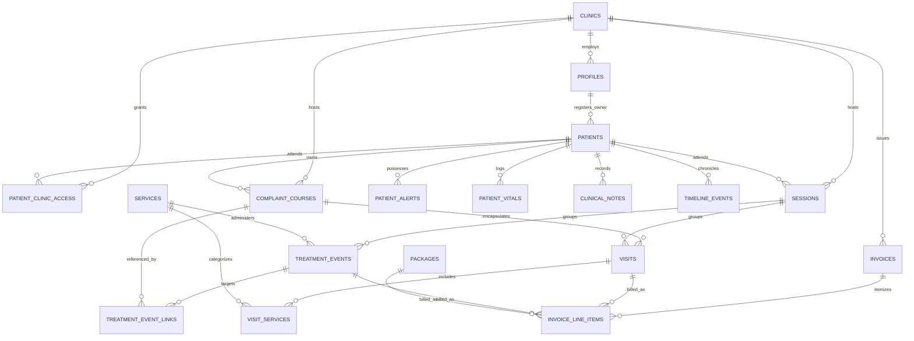

# Clinic Backend Specification & Architectural Engine Room (`clinic-demo-be`)

> **[AI-maintained repo]**<br>
> **Architectural Laboratory & PostgreSQL / Supabase v11 Invariant Engine**  
> Pairing with the [`clinic-demo`](https://github.com/omsrivastava512/clinic-demo) outpatient physiotherapy and rehabilitation frontend.

---

## 1. Executive Summary & Architectural Philosophy

### 1.1 The Problem Space
Outpatient physiotherapy and physical rehabilitation clinics operate under domain constraints fundamentally distinct from general practice or acute care:
- **Prolonged Treatment Arcs**: Patients present with one or more concurrent, anatomical complaint courses (e.g., Cervical Radiculopathy alongside Knee Osteoarthritis) that evolve over weeks across dozens of sessions.
- **Multi-Bucket Pricing Realities**: Fees cannot be modeled as flat consultation charges or simple itemized cart totals. Encounters blend lifetime diagnostic assessments, therapy tier rates (Regular vs. Neurological/Rehab), consecutive absence penalties, equipment modalities, and standalone specialty procedures.
- **Multi-Branch, Single-Owner Tenancy**: A regional clinic chain operates multiple physical facilities under a single administrative owner. While patients maintain a single cross-branch clinical identity, staff members at Branch A must never access records belonging solely to Branch B without explicit cross-attendance authorization.
- **Fast-Paced Reception Desk Throughput**: Front-desk operations cannot tolerate distributed state corruption, abandoned half-saved encounters, or UI latency caused by fragmented network writes.

### 1.2 Architectural Philosophy: Database-Enforced Correctness
Most medical management systems delegate critical clinical and financial integrity rules to application code. When multiple client interfaces (web portals, mobile apps, batch background jobs) interact with the backend, business rules drift, client bugs cause revenue leakage, and race conditions introduce phantom data.

This repository champions **database-enforced correctness over application-layer trust**:
1. **Never Trust Client Math**: Monetary totals, fees, and invoice balances are never accepted as raw numbers from client requests. They are calculated or verified against database rate matrices, validated by trigger functions, and locked via `GENERATED ALWAYS AS` columns.
2. **Atomic Submission Batches**: In-flight encounter progress remains client-side memory state. The database transitions from "nothing recorded" to "fully committed encounter with line items" within an atomic transaction.
3. **Trigger-Enforced Referential Integrity**: Tenancy boundaries, sequential human-readable invoice counters, ownership attribution, and parent-child linkages are derived and enforced by PostgreSQL triggers running under `SECURITY DEFINER` constraints rather than trusting incoming parameters.
4. **Read-Time Derived State Over Stale Columns**: Overdue statuses, patient attendances, and effective pricing overrides are calculated at query time via `WITH (security_invoker = true)` views rather than fragile periodic cron mutations.

---

## 2. Domain Architecture & Core Business Invariants

```
                                  CLINICAL SESSION ENCOUNTER
                                               │
                    ┌──────────────────────────┴──────────────────────────┐
                    ▼                                                     ▼
         4-BUCKET VISIT ENGINE                                 STANDALONE SPECIALTY
   (Complaint-Course Bound Treatment)                   (Carve-Outs / Shallow Walk-Ins)
                    │                                                     │
   ┌────────────────┼────────────────┬────────────────┐                   │
   ▼                ▼                ▼                ▼                   ▼
Bucket 1         Bucket 2         Bucket 3         Bucket 4            Bucket 5
[Exam Fee]   [Lapse Penalty]    [Therapy Fee]    [Visit Services]  [Treatment Events]
  ₹350             ₹150          ₹200 / ₹300      Itemized Catalog    Flat Procedure
(Lifetime)       (10+ Day)     (Regular/Rehab)    (Standard/Machine)   (e.g., Cupping)
   │                │                │                │                   │
   └────────────────┴────────────────┴────────────────┴───────────────────┘
                                     │
                                     ▼
                     ATOMIC CHECKOUT & INVOICE MINT
                     (Deferred Constraint Integrity)
                                     │
                                     ▼
                             [INVOICE ENGINE]
                        INV-YYYY-XXXX (Sequential)
```

### 2.1 The 4-Bucket Fee Engine
Clinical visits bill through four discrete financial buckets modeled on the [`visits`](docs/supabase_migration.md#L635) table, culminating in an unalterable generated total:

```sql
grand_total_in_paise integer generated always as (
  exam_fee_in_paise + lapse_penalty_in_paise + therapy_fee_in_paise + services_total_in_paise
) stored
```

#### Bucket Breakdown & Invariants

| Bucket | Column Name | Baseline Rule | Clinical Scoping & Deduplication |
| :--- | :--- | :--- | :--- |
| **Bucket 1: Initial Exam** | `exam_fee_in_paise` | ₹350 (35,000 paise) | **Lifetime Scoped**: Charged strictly once per patient lifetime. If an established patient presents a brand-new complaint months later, the examination is ₹0. Shared at most once per patient per calendar day across all concurrent complaints. |
| **Bucket 2: Lapse Penalty** | `lapse_penalty_in_paise` | ₹150 (15,000 paise) | **10+ Consecutive Missed Days**: Triggers on reactivation after a 10+ day abandonment gap. Shared once across all complaints reactivating on the same day. Mutually exclusive with Bucket 1. |
| **Bucket 3: Therapy Fee** | `therapy_fee_in_paise` | Tiered: Regular ₹200 / Rehab ₹300 | **Per-Complaint Additivity**: Evaluated per body part/complaint treated. Two regular complaints treated in one session incur ₹200 + ₹200 = ₹400 therapy. |
| **Bucket 4: Visit Services** | `services_total_in_paise` | Itemized Catalog | **Modality Add-ons**: Sum of billable standard equipment (TENS, IFT, Ultrasound) used in `MACHINE_ONLY` visits or chargeable add-ons. |

#### The Compound Check Invariant
A recurring architectural pitfall in clinic billing is testing only whether a visit row exists today (`EXISTS (SELECT 1 FROM visits WHERE patient_id = X AND date = TODAY)`). This check breaks whenever an earlier encounter was a `MACHINE_ONLY` visit or an ordinary follow-up (`therapy_fee` only). 

The billing engine enforces a compound lookup:
```sql
-- Checks if the patient has ALREADY incurred the flat fee on this calendar day:
EXISTS (
  SELECT 1 FROM visits 
  WHERE patient_id = NEW.patient_id 
    AND date = CURRENT_DATE 
    AND exam_fee_in_paise > 0
)
```
*(Reference: [`study/business_logic/fee_computation/DISCUSSION.MD`](study/business_logic/fee_computation/DISCUSSION.MD#L13-L27)).*

#### Pricing Integrity & Transactional Overrides
Clinical realities necessitate discretionary discounts, hardship waivers, and promotional rates. To prevent the corruption of financial reports:
1. `grand_total_in_paise` remains the uncompromised mathematical baseline.
2. Four dedicated override columns manage deviations: `final_amount_in_paise`, `override_reason`, `override_by` (FK to [`profiles`](docs/supabase_migration.md#L140)), and `override_status` (`'none'`, `'pending'`, `'approved'`).
3. An audit trigger enforces that `final_amount_in_paise` can deviate from the computed total only when authorized by an admin profile.
4. Billing consumers read from the `visits_with_effective_charge` view (`WITH (security_invoker = true)`), resolving effective charges via `COALESCE(final_amount_in_paise, grand_total_in_paise)`.

---

### 2.2 Package Lifecycle & Deferral Architecture
Patients frequently purchase multi-session care packages upfront (e.g., 10 sessions at ₹6,000).

```
UPFRONT PURCHASE (Day 1)
[Invoices] ──► ₹6,000 Revenue Recognized (visit_id = NULL)
[Packages] ──► Status: 'Active', duration_days: 10, linked_complaint_id: <UUID>

SESSION EXECUTION (Days 2–11)
New Visit ──► derive_package_id_and_apply_coverage Trigger Fires:
              1. Finds Active Package for (linked_complaint_id)
              2. Sets visits.package_id = packages.id
              3. Zeroes visits.therapy_fee_in_paise = 0
              4. Exam/Lapse & Specialty buckets remain UNTOUCHED
```

#### Architectural Invariants:
1. **Isolated Zeroing**: The package trigger touches **only** `therapy_fee_in_paise`. If an initial exam (₹350) or lapse penalty (₹150) fires on that visit, it is charged normally.
2. **Partial Unique Index**:
   ```sql
   create unique index idx_one_active_package_per_complaint
     on packages (linked_complaint_id)
     where status = 'Active';
   ```
   Ensures deterministic trigger lookup without Postgres `SELECT INTO` silent multi-match errors.
3. **The Deferral Boundary**: Full attendance tracking (day logs, freeze/hold segments, Sunday exclusions, and penalty calculations) was deliberately deferred for the initial operational rollout. The schema implements **Tier-0 Revenue Capture**: the upfront fee is captured cleanly in `packages` and `invoices`, with the zeroing hook deployed on `visits`, while scheduling logic remains deferred.  
*(References: [`study/business_logic/packages_logic/DEFERRAL.md`](study/business_logic/packages_logic/DEFERRAL.md) and [`plans/mvp/mvp-index.md`](plans/mvp/mvp-index.md)).*

---

### 2.3 The Discrete Batch Encounter Model (The "Amazon Cart" Analogy)
Legacy clinic software attempts to record a visit row the moment a receptionist clicks an intake button, and an invoice row the moment a procedure checkbox is toggled. This "progressive write" model causes orphaned records, broken state machines, and fragmented invoices.

The architecture implements a **Discrete Batch Encounter Model**:
- The reception UI accumulates encounter data in memory (`useProcedureLogger` client state).
- When the receptionist clicks **Create Invoice**, the entire payload is submitted to an atomic orchestration function: [`checkout_and_create_invoice(...)`](study/business_logic/speciality_and_invoice/specialty-decision-log.md#L308-L404).

```sql
create or replace function checkout_and_create_invoice(
  p_clinic_id         uuid,
  p_patient_id        uuid,
  p_visits            jsonb,
  p_treatment_events  jsonb,
  p_payment_status    text default 'Pending'
) returns uuid
language plpgsql security definer as $$
...
-- 1. Insert sessions row
-- 2. Insert invoices row (triggers sequential INV-YYYY-XXXX number)
-- 3. Loop visits: insert complaint_courses (if new), visits, visit_services, invoice_line_items
-- 4. Loop treatment_events: insert treatment_events, treatment_event_links, invoice_line_items
-- 5. Return invoice_id
$$;
```
*(Reference: [`study/business_logic/speciality_and_invoice/specialty-decision-log.md`](study/business_logic/speciality_and_invoice/specialty-decision-log.md#L288-L404)).*

---

### 2.4 The Dual-Axis Specialty Routing Rule
Specialty modalities such as Spinal Traction, Cupping, Dry Needling, and High-Intensity Laser cannot be categorized cleanly as either "always bundled" or "always standalone".

A patient receiving Lumbar Traction as part of a prescribed Back Pain course gets it bundled under the flat therapy fee. Another walk-in patient presenting an external prescription for Traction with no active complaint course receives it as a standalone paid service.

Routing is governed by a **Dual-Axis Evaluation Matrix**:

| Axis 1: Complaint Context | Axis 2: Catalog Carve-Out (`is_specialty_carveout`) | Persistence Table | Linkage / Attribution |
| :--- | :--- | :--- | :--- |
| **Has Complaint Context** | **False (Standard Service)** | `visit_services` | Bound to parent `visits` row. Bundled into `therapy_fee_in_paise`. |
| **Has Complaint Context** | **True (Named Carve-Out: Cupping, Laser)** | `treatment_events` | Standalone fee in `treatment_events`; linked via `treatment_event_links` to `complaint_courses.id`. |
| **No Complaint Context (Walk-In)** | **Any Service** | `treatment_events` | Standalone fee in `treatment_events`; linked via `treatment_event_links` to `catalog_region` enum. |

```sql
-- Polymorphic link constraint on treatment_event_links:
constraint chk_treatment_event_link_target check (
  (complaint_course_id is not null and catalog_region is null) or
  (complaint_course_id is null and catalog_region is not null)
)
```

#### Core Financial Invariant
**Specialty treatment revenue is never apportioned across complaints.** Even if a session of Cupping Therapy covers both Neck and Shoulder regions, the revenue is captured in its own independent accounting bucket (`treatment_events.computed_amount_in_paise`), preventing double-counting in complaint-level analytics.  
*(References: [`study/business_logic/speciality_and_invoice/specialty-decision-log.md`](study/business_logic/speciality_and_invoice/specialty-decision-log.md#L210-L217) and [`plans/frontend-backend-wiriing-proposal.md`](plans/frontend-backend-wiriing-proposal.md#L408-L425)).*

---

### 2.5 Ghost Invoice & Double-Billing Safeguards
To guarantee financial ledger integrity across distributed transactions:

1. **Ghost Invoice Prevention**: An invoice must never exist without line items, nor may its total disagree with the sum of its items. PostgreSQL rejects subqueries inside `CHECK` constraints, so this invariant is enforced via an **After-Insert Deferred Constraint Trigger**:
   ```sql
   create constraint trigger trg_check_invoice_line_items_integrity
     after insert on invoices
     deferrable initially deferred
     for each row execute procedure check_invoice_line_items_integrity();
   ```
   At transaction commit, the trigger verifies `COUNT(line_items) >= 1` and `SUM(line_items.amount) = invoice.amount_in_paise`. If mismatched, the entire encounter transaction rolls back.
2. **Line-Item Source Mutual Exclusion**: An invoice line item must point to exactly one source entity:
   ```sql
   constraint chk_line_item_source check (
     num_nonnulls(visit_id, treatment_event_id, package_purchase_id, product_sale_id) = 1
   )
   ```
3. **Double-Billing Safeguards**: Each billable entity can be invoiced at most once across non-void invoices. A database trigger validates that no source entity references an invoice whose `payment_status != 'Void'`.

---

## 3. Database & Tenancy Architecture (Supabase v11)

### 3.1 Entity-Relationship Architecture



```
                        ┌─────────────────────────┐
                        │         CLINICS         │
                        └────────────┬────────────┘
                                     │ 1:M
             ┌───────────────────────┼───────────────────────┐
             ▼                       ▼                       ▼
      ┌─────────────┐     ┌─────────────────────┐     ┌─────────────┐
      │  PROFILES   │     │PATIENT_CLINIC_ACCESS│     │  INVOICES   │
      └──────┬──────┘     └──────────▲──────────┘     └──────┬──────┘
             │ 1:M (admin)           │ 1:M                   │ 1:M
             ▼                       │                       ▼
      ┌─────────────┐                │             ┌───────────────────┐
      │  PATIENTS   ├────────────────┘             │INVOICE_LINE_ITEMS │
      └──────┬──────┘                              └─────────▲─────────┘
             │ 1:M                                           │
     ┌───────┴───────┬───────────────────────┐               │
     ▼               ▼                       ▼               │
┌─────────┐   ┌──────────────┐      ┌─────────────────┐      │
│ ALERTS, │   │   SESSIONS   │      │COMPLAINT_COURSES│      │
│ VITALS, │   └──────┬───────┘      └────────┬────────┘      │
│ NOTES   │          │ 1:M                   │ 1:M           │
└─────────┘     ┌────┴──────────────┐        │               │
                ▼                   ▼        ▼               │
         ┌─────────────┐         ┌───────────────┐           │
         │  TREATMENT  │         │    VISITS     ├───────────┤
         │   EVENTS    ├────┐    └───────┬───────┘           │
         └──────┬──────┘    │            │ 1:M               │
                │ 1:M       │            ▼                   │
                ▼           │    ┌───────────────┐           │
        ┌───────────────┐   │    │VISIT_SERVICES ├───────────┘
        │TREATMENT_EVENT│   │    └───────┬───────┘
        │     LINKS     │   │            │ M:1
        └───────────────┘   │            ▼
                            │    ┌───────────────┐
                            └───►│   SERVICES    │
                                 └───────────────┘
```

---

### 3.2 Schema Hierarchy & Tenancy Partitioning
Tenancy isolation differentiates between **Location-Specific** clinical operations and **Patient-Global** identities:

```
[CHAIN LEVEL (owner_id = admin)]
    │
    ├── patients (mrn unique per owner_id)
    ├── patient_alerts
    ├── patient_vitals
    ├── clinical_notes
    └── timeline_events
           │
           ├── [patient_clinic_access] (Junction: which branches patient attended)
           │
[BRANCH LEVEL (clinic_id = branch)]
    ├── complaint_courses
    ├── sessions
    ├── visits
    ├── visit_services
    ├── treatment_events
    ├── packages
    └── invoices
```

#### The Cross-Branch Identity Model
- In v1–v3, `patients.clinic_id` locked a patient to a single branch. If a patient visited Branch B, staff had to register a duplicate record.
- In v4+, `patients.clinic_id` was replaced with `patients.owner_id` (chain admin profile).
- Branch visibility is mediated by `patient_clinic_access(patient_id, clinic_id)`.
- Staff RLS Policy:
  ```sql
  create policy "staff_patients_read" on patients
    for select to authenticated
    using (
      id in (
        select patient_id from patient_clinic_access
        where clinic_id = (select clinic_id from profiles where id = auth.uid())
      )
    );
  ```
- Admin RLS Policy:
  ```sql
  create policy "admin_patients_all" on patients
    for all to authenticated
    using (
      owner_id = auth.uid() and 
      (select role from profiles where id = auth.uid()) = 'admin'
    );
  ```

---

### 3.3 The Shallow Walk-In Read Deadlock Resolution
In early iterations, `patient_clinic_access` was auto-provisioned inside `process_new_complaint_course()` during complaint intake. This created two critical deadlocks:

1. **The Circular First-Visit Deadlock (v5)**: `complaint_courses` validated access against `patient_clinic_access`, which required a visit, which in turn required an existing complaint course.
2. **The Shallow Walk-In Read Deadlock (SPECIALTY-10/20)**: Service-seeker walk-ins (patients purchasing retail products or undergoing standalone dry needling) never create a complaint course. Under staff RLS, immediately after creating the patient row, a frontend re-fetch returned empty results because no `patient_clinic_access` row existed.

#### The Architectural Fix
The intake trigger was moved directly to [`patients`](docs/supabase_migration.md#L233):
```sql
create or replace function patients_provision_initial_access()
returns trigger as $$
declare
  staff_clinic uuid;
begin
  select clinic_id into staff_clinic from profiles where id = auth.uid();
  if staff_clinic is not null then
    insert into patient_clinic_access (patient_id, clinic_id)
    values (new.id, staff_clinic)
    on conflict (patient_id, clinic_id) do nothing;
  end if;
  return new;
end;
$$ language plpgsql security definer;

create trigger patients_after_insert_provision_access
  after insert on patients
  for each row execute procedure patients_provision_initial_access();
```
*(Reference: [`study/business_logic/speciality_and_invoice/specialty-decision-log.md`](study/business_logic/speciality_and_invoice/specialty-decision-log.md#L202-L209)).*

---

### 3.4 Table Summary Inventory

| Table | Primary Key | Tenancy Key | Description | Key Invariants / Triggers |
| :--- | :--- | :--- | :--- | :--- |
| [`clinics`](docs/supabase_migration.md#L75) | `uuid` | `owner_id` | Branch location settings and fee policies. | `invoice_counter` atomic sequence tracking; `validate_owner_is_admin`. |
| [`profiles`](docs/supabase_migration.md#L140) | `uuid` (auth) | `clinic_id` (null for admin) | System actors with roles: receptionist, clinician, admin. | Cascades from `auth.users`; role enum check. |
| [`patients`](docs/supabase_migration.md#L233) | `uuid` | `owner_id` | Master patient demographic index. | `UNIQUE(owner_id, mrn)`; `chk_referral_doctor_info`. |
| [`patient_clinic_access`](docs/supabase_migration.md#L314) | `uuid` | `clinic_id` | Cross-branch patient attendance junction. | Auto-provisioned by `SECURITY DEFINER` triggers; client writes blocked. |
| [`complaint_catalog`](docs/supabase_migration.md#L455) | `text` (seed) | Global | Standardized anatomical diagnoses. | Seed reference data (`CAT_S01`, etc.); 7 anatomical regions. |
| [`complaint_courses`](docs/supabase_migration.md#L479) | `uuid` | `clinic_id` | Episode-of-care tracking per complaint. | `process_new_complaint_course()` cross-chain tenancy validation. |
| [`services`](docs/supabase_migration.md#L589) | `text` (seed) | Global | Master catalog of modalities and procedures. | Categorized as `STANDARD` or `PREMIUM`; `is_specialty_carveout`. |
| [`clinic_service_prices`](docs/supabase_migration.md#L608) | `uuid` | `clinic_id` | Branch-specific price overrides for services. | `COALESCE(override, base_price)` resolution pattern. |
| [`sessions`](study/business_logic/speciality_and_invoice/specialty-decision-log.md#L297) | `uuid` | `clinic_id` | Administrative encounter container for batch visits. | Groups concurrent visits and treatment events. |
| [`visits`](docs/supabase_migration.md#L635) | `uuid` | `clinic_id` | Individual complaint clinical treatment record. | 4-bucket financial columns; `grand_total_in_paise` generated. |
| [`visit_services`](docs/supabase_migration.md#L697) | `uuid` | `clinic_id` | Junction of services administered during a visit. | `clinic_id` derived from parent visit via trigger. |
| [`treatment_events`](study/business_logic/speciality_and_invoice/specialty-decision-log.md#L384) | `uuid` | `clinic_id` | Standalone specialty service delivery records. | Independent revenue bucket; 4-column override pattern. |
| [`treatment_event_links`](study/business_logic/speciality_and_invoice/specialty-decision-log.md#L393) | `uuid` | Derived | Polymorphic target link for treatment events. | Enforces XOR: `complaint_course_id` OR `catalog_region`. |
| [`packages`](docs/supabase_migration.md#L737) | `uuid` | `clinic_id` | Multi-session prepaid treatment contracts. | Partial unique index: at most one active package per complaint. |
| [`invoices`](docs/supabase_migration.md#L783) | `uuid` | `clinic_id` | Financial bill and collection record. | Atomic human-readable `invoice_number` generation (`INV-YYYY-XXXX`). |
| [`invoice_line_items`](study/business_logic/speciality_and_invoice/specialty-decision-log.md#L376) | `uuid` | Derived | Granular line-item breakdown for invoices. | XOR check constraint across 4 sources; deferred sum matching. |

---

## 4. Frontend Integration & Workflow State Machine

The frontend showcase (`src/pages/vistitworkflow.tsx`) models the clinical reception journey across five podium screens.

```
┌─────────────────┐       ┌──────────────────────┐       ┌──────────────────────┐
│  01. DAILY      │       │  02. PATIENT INTAKE  │       │  03. COMPLAINT       │
│      LEDGER     │──────►│      (If New)        │──────►│      SELECTOR        │
│  (Queue / Search│       │ (Chain Registration) │       │ (Pick / Add Episodes)│
└─────────────────┘       └──────────────────────┘       └──────────────────────┘
                                                                    │
                                                                    ▼
┌─────────────────┐       ┌──────────────────────┐       ┌──────────────────────┐
│  LEDGER REFRESH │       │  05. INVOICE         │       │  04. PROCEDURE       │
│  & CLOSEOUT     │◄──────│      BUILDER         │◄──────│      LOGGER          │
│  (Real-Time OPD)│       │ (Pending/Paid Modes) │       │ (Modality Checklist) │
└─────────────────┘       └──────────────────────┘       └──────────────────────┘
```

### 4.1 Screen Contracts & Data Pipeline

1. **[`01 DailyLedger`](plans/workflow_screens_audit.md#L22)**:  
   - Displays real-time OPD attendance. Queries the `daily_ledger` view (`WITH (security_invoker = true)`).
   - Searches patients via `pg_trgm` GIN index on `patients.full_name`. Emits selected patient or triggers new registration.
2. **[`02 NewPatientIntake`](plans/workflow_screens_audit.md#L23)**:  
   - Captures chain-level demographics. Normalizes age input into `date_of_birth`.
   - Auto-generates MRN formatted per clinic convention. Upon submission, triggers `patients_provision_initial_access` to establish immediate branch visibility.
3. **[`03 ComplaintSelector`](plans/workflow_screens_audit.md#L24)**:  
   - Displays active `complaint_courses` for the patient. Permits catalog search (`complaint_catalog`) or free-text creation.
   - Emits an array of active complaints to downstream logging without executing premature database writes.
4. **[`04 ProcedureLogger`](plans/workflow_screens_audit.md#L25)**:  
   - Receptionist checks modalities administered per complaint (IFT, Traction, Ultrasound).
   - Features the `(+ Add Specialty Treatment)` modal (Approach D) for dry needling, cupping, or laser.
   - Maintains an in-memory `InvoiceItem[]` array and live-updates the session bill calculation.
5. **[`05 InvoiceBuilder`](plans/workflow_screens_audit.md#L26)**:  
   - Dispatches the coordinated `checkout_and_create_invoice(...)` RPC.
   - Receives the atomic invoice number (`INV-YYYY-XXXX`) in the mutation response.
   - Defaults to **Pending-by-Default** status so the receptionist can return to the ledger immediately if a patient is slow to settle payments.

### 4.2 Progressive vs. Coordinated Writes
A central architectural finding of the [`plans/workflow_screens_audit.md`](plans/workflow_screens_audit.md) and [`plans/frontend-backend-wiriing-proposal.md`](plans/frontend-backend-wiriing-proposal.md) was rejecting progressive writes in favor of **Coordinated Submissions**:

- **The Progressive Flaw**: If clicking a procedure toggles a database write, an abandoned reception checkout leaves real visit rows behind. Because `visits` rows represent completed clinical encounters, these orphaned entries corrupt the ledger and overcharge subsequent deduplication checks.
- **The Coordinated Solution**: All five screens mutate local state. When **Create Invoice** is pressed, the single RPC coordinates inserts across `sessions`, `visits`, `treatment_events`, `invoices`, and `invoice_line_items` inside one PostgreSQL transaction. Failure at any point results in a total rollback.

### 4.3 Asynchronous Payment Status & Split Payments
- **Pending-by-Default**: To prevent front-desk bottlenecks, clicking "Create Invoice" immediately commits the encounter with `payment_status = 'Pending'`.
- **Read-Time Overdue Calculation**: Rather than relying on periodic batch jobs, overdue aging is derived dynamically:
  ```sql
  create or replace view invoices_with_effective_status
  with (security_invoker = true) as
  select
    i.*,
    case
      when i.payment_status = 'Pending' and i.date < current_date then 'Overdue'
      else i.payment_status
    end as effective_status
  from invoices i;
  ```
- **Payment Collection**: When payment is tendered, [`confirm_invoice_payment(invoice_id, payment_mode)`](study/business_logic/speciality_and_invoice/specialty-decision-log.md#L528-L545) updates `payment_status = 'Paid'`, stamps `paid_by = auth.uid()`, and records `paid_at = now()`.

---

## 5. Repository Layout & Knowledge Navigation Map

```
clinic-demo-be/
├── docs/                                 # Authoritative Schema & System Specifications
│   ├── supabase_migration.md             # Complete Supabase v11 DDL migration script (tables, triggers, RLS)
│   ├── schema_cross_reference.md         # Column-by-column justification cross-referenced with frontend types
│   ├── backend-schema-iterations.md      # Historical audit of schema versions v1 through v11
│   ├── FRONTEND_WORKFLOW.md              # Reception desk UI state transitions & architectural decisions
│   ├── FRONTEND_DASHBOARD.md             # Multi-branch executive metrics and reporting architecture
│   └── FRONTEND_PATIENT_PROFILE.md       # Clinical chart, vitals grid, and longitudinal history contracts
│
├── study/                                # Architectural Studies, Decision Logs & Pre-Implementation Proofs
│   ├── business_logic/
│   │   ├── speciality_and_invoice/       # Specialty Treatments, Session Boundary & Line Item Architecture
│   │   │   ├── specialty-decision-log.md # Exhaustive running log (Entries 01–31) covering SPECIALTY-01 to 13
│   │   │   ├── DISCUSSION.md             # Deep-dive session transcripts on transaction boundaries & routing
│   │   │   └── specialty-treatment-ux-mockups.md # ASCII wireframes for Specialty modal interactions (Approaches A–D)
│   │   ├── fee_computation/              # 4-Bucket Fee Engine, Deduplication & Gap Rules
│   │   │   └── DISCUSSION.MD             # Lifetime exam scoping, compound checks, and clinic configurability
│   │   ├── packages_logic/               # Package Lifecycle, Attendance Triggers & Deferral Boundaries
│   │   │   ├── DEFERRAL.md               # Blast-radius analysis, dormant hooks, and Tier-0 revenue capture
│   │   │   └── README.md                 # Package data model and attendance state machine
│   │   └── general/                      # Client Discussions & Global Business Rules
│   │       ├── README.md                 # Foundational business rules log from clinic owner interviews
│   │       └── migration/                # Handover specifications across billing, packages, and overrides
│   ├── module_1/                         # Early Domain Modeling & Schema Iteration Proofs
│   │   ├── DECISIONS.md                  # Resolved decisions on permissions, clinicians, and invoices
│   │   └── GAPS.md                       # Identified technical debt and missing constraint analysis
│   └── module_2/                         # Tenancy, RLS & Cross-Branch Access Audit
│       └── LOGS.md                       # Real bugs, RLS bypass vectors, and clinic derivation analysis
│
└── plans/                                # Implementation Plans, Audits & Wiring Proposals
    ├── mvp/                              # Production MVP Scope Scrutiny & Boundary Diagnosis
    │   ├── mvp-index.md                  # Executive index: What to build now vs. defer entirely
    │   ├── mvp-revalidation-four-studies.md # Technical defense of schema invariants vs. premature complexity
    │   ├── mvp-pricing-waiver-analysis.md   # Structural analysis of per-patient rate fields vs. override tables
    │   ├── mvp-scope-diagnosis.md        # Concrete UI/backend cuts and migration risk profiles
    │   └── mvp-stepback-review.md        # Root-cause analysis of feature ballooning and design pruning
    ├── workflow_screens_audit.md         # Multi-agent deep audit of the 5 podium reception screens
    └── frontend-backend-wiriing-proposal.md # Concrete contract wiring: RPC boundaries, error dispatch & triggers
```

---

## 6. Decision-As-You-Code & Architectural Traceability

Every architectural choice, refactoring step, and structural constraint in this codebase adheres to the strict **Decision-As-You-Code** protocol. Decisions are documented directly alongside the SQL triggers, functions, and markdown specifications.

### Metadata Tag Structure
When code or schema logic is altered, a structured `DECISION` block captures the origin, trigger, and invariants:

```sql
-- DECISION [TRIGGER: RUNTIME_BUG] [ORIGIN: USER_OVERRULED_AI]:
-- AI proposed deriving clinic_id on visits via a BEFORE INSERT trigger reading profiles.clinic_id.
-- User overruled: profiles.clinic_id is NULL for chain admins by design, which locks admins out of inserts.
-- Solution: Validated against patient_clinic_access junction table instead.
-- Invariant: An insert is valid if (patient_id, clinic_id) exists in patient_clinic_access.
-- Revisit When: Dedicated multi-chain RBAC roles are introduced.
```

### Traceability Dimensions
- **Trigger**: `RUNTIME_BUG` (deadlocks, constraint failures), `TYPE_CONSTRAINT` (PostgreSQL typing, DDL ordering), `PRODUCT_SPEC` (clinical workflow realities), `CODE_REVIEW` (peer scrutiny), or `TECH_DEBT` (proactive hardening).
- **Origin**: `USER_DIRECTIVE` (client-mandated business invariant), `USER_OVERRULED_AI` (correction of an AI assumption), `AI_PROPOSAL_APPROVED` (formalized architectural proposal), or `AI_AUTONOMOUS` (low-level tactical fallback).
- **Reasoning Trail**: Explicit statement of rejected alternatives, protected invariants, and future migration triggers.

---

## 7. Migration Verification & Quickstart

To stand up the complete database schema within Supabase:

1. **Prerequisites**: Supabase project running PostgreSQL 15+ with the `pg_trgm` extension enabled.
2. **Execute Migration**:
   - Open your Supabase Dashboard → **SQL Editor** → **New Query**.
   - Copy the entire SQL content from [`docs/supabase_migration.md`](docs/supabase_migration.md).
   - Execute query.
3. **Verify Integrity**:
   ```sql
   -- Verify all 16 clinical tables exist:
   SELECT table_name FROM information_schema.tables 
   WHERE table_schema = 'public' AND table_type = 'BASE TABLE';

   -- Verify view security:
   SELECT table_name, view_definition 
   FROM information_schema.views 
   WHERE table_schema = 'public';

   -- Confirm RLS is enabled across all tables:
   SELECT tablename, rowsecurity 
   FROM pg_tables 
   WHERE schemaname = 'public';
   ```
4. **Seed Reference Catalogs**:
   - Seed standard diagnoses from `complaint_catalog`.
   - Seed services and pricing from `services` (`SVC-01` to `SVC-13`).
   - Create owner profile with `role = 'admin'` and wire initial `clinics` row.

---

*Authoritative Backend Specification & Architecture Portfolio Artifact — 2026.*