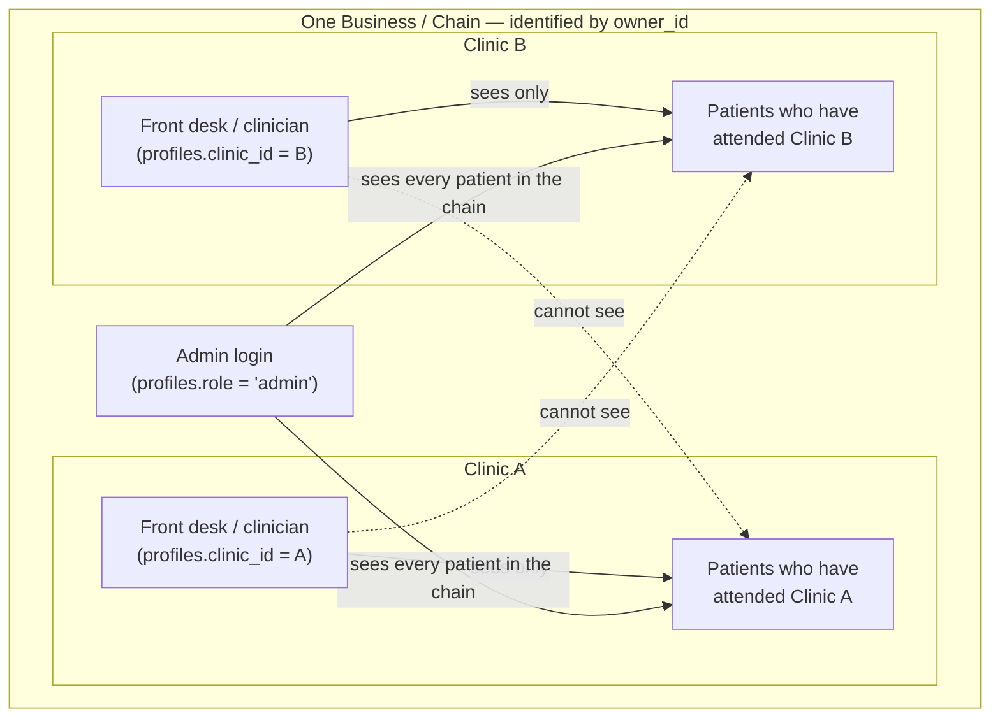
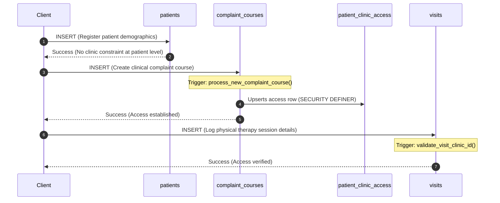

# Backend Schema Iterations

This document tracks the step-by-step iterations, Q&A sessions, architectural decisions, and schema designs for the clinic management system backend.

**Reference Context:** [codebase-context.md](file:///c:/Github/clinic-demo/.agents/learnings/codebase-context.md)
**Migration File Reference:** [supabase_migration.md](file:///C:/Users/HP/.gemini/antigravity/brain/3545fb0f-2af4-42f0-a0aa-010e4af11f9d/supabase_migration.md)

---

## How to Read This Document

This version fixes three problems found in the original: a couple of code snippets that had drifted from what the real migration file actually contains, one undocumented design pivot between Iteration 1 and Iteration 2, and a lack of any signal for which issues actually mattered how much. Three things to know before reading:

**Severity tags.** Every flagged issue below is tagged with one of:
- 🔴 **Structural** — changes the shape of a table or the relationships between tables. Expensive to change once real data exists, because fixing it later means migrating existing rows. These are the ones worth getting right before launch.
- 🟡 **Safety-net** — a validation rule or trigger, not a change to what a row looks like. Cheap to add or change at any time, including after real data exists, because no migration is required.
- 🟢 **Performance** — a speed optimization with no effect on behavior or correctness either way.

**Code snippets.** Two snippets in the original document (marked below) didn't match what the real migration file actually contains — the documenting agent reconstructed them from memory of the conversation rather than copying them verbatim, and small details drifted. Those two are corrected here. Everywhere else, the prose descriptions of what changed and why held up fine against the real file.

**The SaaS caveat.** A few checks (flagged inline where they appear) only matter if this system ever runs as multi-tenant SaaS — multiple unrelated clinic chains sharing one database. If the deployment model ends up being one isolated Supabase project per customer instead, those specific checks become moot (harmless to keep, just not load-bearing). That decision hasn't been made yet, so treat those items as conditional, not required.

---

## Current State at a Glance (as of v11)

Before the historical iterations below, here's what the access model actually looks like today, in one picture:



A patient is one identity shared across every branch of the chain (`patients.owner_id`), not a separate record per branch. Which branches a given patient is actually visible at is tracked separately, in `patient_clinic_access` — a row is added there automatically the first time a complaint course is opened for that patient at a given clinic. Location-specific records (visits, invoices, packages) stay scoped to the single branch where they happened; patient-global records (alerts, vitals, notes, timeline) are visible to any branch that patient has attended.

---

## Iteration 1: Multi-Location Multi-Tenancy & Role-Based Access Control

🔴 **Structural** — this is the original proposed design.

### 1. Onboarding Q&A
After analyzing the codebase context, the following scoping and role requirements were clarified:

*   **Q: Will this system ever run for more than one clinic, or is it built for one clinic's internal use only?**
    *   **A:** No decision yet. Starting with one clinic but planning to scale. Not sure yet if selling different copies to different clinics/chains or selling it as a SaaS. Crucially, the initial client is a chain of 3 clinics with one owner/admin, meaning staff/receptionists must not see other clinics' records, but the admin needs global access.
*   **Q: Do different staff need different permissions (e.g., front desk vs. clinician vs. admin)?**
    *   **A:** Yes, different roles need different access levels.

---

### 2. Proposed Database Schema
To support a multi-location setup that scales seamlessly to a multi-tenant SaaS without future database rewrites, a three-tier hierarchy is established: **Business -> Clinic -> Staff/Patients/Records**.

```sql
-- The scoping hierarchy
create table businesses (
  id uuid primary key default gen_random_uuid(),
  name text not null
);

create table clinics (
  id uuid primary key default gen_random_uuid(),
  business_id uuid references businesses(id) not null,
  name text not null
  -- address, phone, etc.
);

create table staff (
  id uuid primary key default gen_random_uuid(),
  user_id uuid references auth.users(id) not null,  -- links to Supabase Auth
  business_id uuid references businesses(id) not null,
  clinic_id uuid references clinics(id),  -- nullable: admins aren't tied to one clinic
  role text not null check (role in ('front_desk', 'clinician', 'admin'))
);
```

Every clinical table (e.g., `patients`, `visits`, `invoices`, `clinical_notes`) will contain a `clinic_id` and/or `business_id` column to scope access.

---

### 3. Row-Level Security (RLS) Policies

```sql
create policy "clinic-scoped access with admin override"
on patients for select
using (
  exists (
    select 1 from staff
    where staff.user_id = auth.uid()
    and staff.business_id = patients.business_id
    and (staff.role = 'admin' or staff.clinic_id = patients.clinic_id)
  )
);
```

```sql
create policy "only clinicians and admins can write clinical notes"
on clinical_notes for insert
with check (
  exists (
    select 1 from staff
    where staff.user_id = auth.uid()
    and staff.role in ('clinician', 'admin')
  )
);
```

---

### 4. Key Architectural Decisions (ADR)
*   **DECISION: Proactive Business/Tenant Scoping:** A `businesses` table is introduced at day one. Retrofitting multi-tenancy later is highly complex; introducing it now avoids future migrations.
*   **DECISION: Role Representation as Enum/Text:** A simple text column with check constraints (`'front_desk', 'clinician', 'admin'`) is used instead of a complex permission/matrix table to avoid premature optimization.
*   **DECISION: Supabase Auth Association:** The `staff` table links directly to `auth.users` via `user_id`, mapping Postgres security contexts (`auth.uid()`) to business roles.

### 5. Practical Implementation Notes
*   **Tenant Separation:** Test RLS by creating two fake staff logins (one per clinic) in a dev project and confirming each one cannot see the other's patients. Do not rely solely on reading the SQL rules.
*   **Future Scope:** Keep permissions flat within the `role` enum. A proper permissions matrix can be added later if you ever need per-action granularity beyond these three roles.

---

## Iteration 2: Critique & Refinement of Initial Schema

🔴 **Structural** (missing `clinic_id` scoping, `complaint_catalog` FK) · 🟡 **Safety-net** (CHECK constraints, invoice sequencing)

> **Note on continuity:** the schema critiqued below did not implement the Iteration 1 proposal. It came from a separate agent pass over the real codebase and took a different shape — a single `profiles` table with a `role` column instead of a dedicated `staff` table, and no `businesses` table at all (a `clinics.owner_id` column pointing directly to an admin's profile was used instead). This alternate shape is what carried forward through every later iteration to the final v11 schema. The Iteration 1 design was superseded here, not built.

### 1. Existing Schema Analysis & Strengths
The developer drafted an initial schema, which demonstrated strong engineering discipline:
*   Stored money as integer `paise` throughout to avoid floating-point errors.
*   Included `created_by` and `clinician_id` audit columns on every clinical table.
*   Implemented `daily_ledger` as a view rather than a duplicated table (retaining visits as the primary unit boundary).
*   Proactively enabled RLS with explicit placeholder/stub policies.
*   Used detailed inline source citations on every column to trace their business requirements.

---

### 2. LLM Critique & Flagged Improvements

#### 🔴 Lack of `clinic_id` Scoping
*   **Problem:** The initial schema did not include `clinic_id` columns on clinical tables (`patients`, `visits`, `invoices`, `complaint_courses`, `packages`, `clinical_notes`, `timeline_events`) or `profiles`.
*   **Correction:** Every clinical table needs a `clinic_id` column to implement the Row-Level Security (RLS) policies from Iteration 1. `profiles` must have a nullable `clinic_id` (so global admins aren't scoped to a single clinic).

#### 🔴 Clinic-Scoped Settings
*   **Problem:** `clinic_settings` was configured as a single-row table. Under a 3-location clinic chain, this forces all locations to share identical fees, addresses, and hours.
*   **Correction:** Add a `clinic_id` column to `clinic_settings` and store one settings row per clinic.

#### 🔴 Dead-Weight `complaint_catalog`
*   **Problem:** The `complaint_catalog` table was created but never referenced. `complaint_courses.complaint_name` was stored as free-form text.
*   **Correction:** Either add a foreign key constraint (`complaint_courses.complaint_catalog_id` referencing `complaint_catalog.id` while retaining a display name snapshot) or drop the table.

#### 🟡 Database-Level Conditional Fields (`CHECK` Constraints)
*   **Problem:** Field dependencies (e.g., `patients.referral_doctor_info` should exist only when `referral_mode = 'DOCTOR'`, and `visits.consultation_type` should be populated only when `visit_type = 'CONSULTATION'`) were only documented in code comments but not enforced at the database level.
*   **Correction:** Add database-level `CHECK` constraints to enforce conditional structures.

#### 🟡 Primary Keys and Sequential Invoices
*   **Problem:** The schema used manual text IDs (e.g., `"INV-001"`) which could lead to collision bugs in concurrent environments. Additionally, there was no auto-incrementing/atomic sequence for invoice numbering.
*   **Correction:** Use `uuid` as primary keys for database operations. For human-readable invoice identifiers, store a separate sequential, clinic-scoped `invoice_number` incremented atomically.

#### 🔴 Timeline Events Integrity
*   **Problem:** `timeline_events` duplicated information and stored `doctor_name`/`doctor_initials` as free-text instead of a foreign key to `profiles(id)`. It also lacked a reference back to the original `visit` or `note`.
*   **Correction:** Redesign `timeline_events` to link back to core entities or make it a dynamic database view if it is meant to auto-populate from other tables.

---

## Iteration 3: The Refactored Supabase Schema (v2)

🔴 **Structural** — implements every fix flagged in Iteration 2.

### 1. Key v2 Schema Refinements & Implementations

*   **Clinics Table Integration:** Created a new `clinics` table containing per-location settings (consultation fees, sunday exclusion default, accepted payment methods, multi-therapist feature flag, color schemes, and config JSONB).
*   **Scoped Profiles:** Scoped the `profiles` table to `clinics` via `clinic_id`. Scoped staff roles to a single clinic, while setting `clinic_id` to nullable for `admin` users who span all locations.
*   **Widespread `clinic_id` Propagation:** Added `clinic_id` as a foreign key on all transactional/clinical tables (`patients`, `patient_alerts`, `patient_vitals`, `clinical_notes`, `complaint_courses`, `visits`, `packages`, `invoices`, `timeline_events`) for multi-tenant Row-Level Security.
*   **Enforced Conditional Relations via Database Constraints:**
    *   `patients.referral_doctor_info` CHECK constraint enforces it is non-null only when `referral_mode = 'DOCTOR'`.
    *   `visits.consultation_type` CHECK constraint enforces it is non-null only when `visit_type = 'CONSULTATION'`.
*   **Atomic Sequential Invoicing:**
    *   Used a database trigger (`generate_invoice_number()`) and a counter (`clinics.invoice_counter`) to assign sequential, per-clinic human-readable invoice IDs (e.g., `INV-2026-0001`) atomically.
    *   Eliminated risk of client-side race conditions.
*   **UUID Conversion:** Shifted primary keys of transactional tables (`visits`, `invoices`, `packages`, `complaint_courses`, `visit_services`, `timeline_events`) to UUIDs. Reference tables (`services`, `complaint_catalog`) kept human-readable text PKs.
*   **Derived Calculations:** Configured `visits.grand_total_in_paise` as a database-generated column (`generated always as (consultation_fee_in_paise + services_total_in_paise) stored`) to guarantee mathematical integrity.
*   **Timeline Events Normalization:** Rewrote `timeline_events` to drop string fields and reference `profiles(id)` via `clinician_id`, adding optional FK links directly to `visit_id` and `note_id`.

---

### 2. Migration Schema Table Summary

| Table | PK Type | Scoping & Core Changes |
|---|---|---|
| `clinics` | UUID | **NEW** — Absorbs clinic configurations & adds invoice_counter |
| `profiles` | UUID (auth) | `clinic_id` added (nullable for admins) |
| `patients` | UUID | `clinic_id`, `mrn` unique per clinic, referral mode CHECK |
| `patient_alerts` | UUID | `clinic_id` scoping |
| `patient_vitals` | UUID | `clinic_id` scoping |
| `clinical_notes` | UUID | `clinic_id` scoping |
| `complaint_catalog` | Text *(seed)* | Reference data |
| `complaint_courses` | UUID *(was text)* | `clinic_id`, `complaint_catalog_id` FK |
| `services` | Text *(seed)* | Reference data |
| `visits` | UUID *(was text)* | `clinic_id`, consultation CHECK, `grand_total` GENERATED |
| `visit_services` | UUID *(was text)* | `visit_id` FK |
| `packages` | UUID *(was text)* | `clinic_id`, `linked_complaint_id` FK |
| `invoices` | UUID *(was text)* | `clinic_id`, trigger-based `invoice_number` |
| `timeline_events` | UUID *(was text)* | `clinic_id`, `clinician_id` FK, optional `visit_id`/`note_id` |
| `daily_ledger` (VIEW) | — | Exposes `clinic_id` for ledger query scoping |

---

### 3. Database Conventions Used

*   **Financials:** Numeric monetary values are stored in `paise` using an integer column with `_in_paise` suffix (e.g., ₹300.00 is stored as `30000`).
*   **Timezones:** Timestamps are stored using `timestamptz` (stored in UTC, converted to local timezone e.g. `Asia/Kolkata` at client-side).
*   **Enums:** Modeled as standard text columns with SQL `CHECK` constraints to simplify future extensions.
*   **Tenancy Scoping:** Fully RLS-enabled. Access rules are prepared to check against staff user roles and clinic assignments:
    ```sql
    using (
      clinic_id = (select clinic_id from profiles where id = auth.uid())
      or (select role from profiles where id = auth.uid()) = 'admin'
    )
    ```

---

## Iteration 4: Safeguarding Tenant Isolation & Per-Clinic Pricing (v3 Migration)

🔴 **Structural** (`visit_services.clinic_id`, `clinic_service_prices`) · 🟡 **Safety-net** (guard triggers)

### 1. Architectural Feedback & Gaps Identified

1.  🟡 **Denormalized `clinic_id` Drift & RLS Vulnerability:**
    *   **Issue:** Because `clinic_id` was denormalized across child tables (`visits`, `clinical_notes`, `packages`, `invoices`, `patient_vitals`, `patient_alerts`, `complaint_courses`) for RLS performance, a bug or malicious client payload could insert a child row with `clinic_id = A` for a patient belonging to `clinic_id = B`. RLS would then enforce access control based on the wrong boundary with total confidence.
    *   **Fix:** Introduce Postgres `BEFORE INSERT OR UPDATE` triggers to automatically derive `clinic_id` directly from the parent record (`patients` or `visits`), ignoring client-provided values.

2.  🔴 **Missing `clinic_id` on Junction Tables:**
    *   **Issue:** `visit_services` did not have a `clinic_id` column, breaking the uniform RLS isolation pattern and requiring an expensive join through `visits`.
    *   **Fix:** Add `clinic_id` to `visit_services` and populate it via a trigger deriving from `visits.clinic_id`.

3.  🔴 **Global vs. Per-Clinic Service Pricing:**
    *   **Issue:** While consultation fees were made location-specific (`clinics.consultation_fee_first_in_paise`), service catalog prices (`services.standalone_price_in_paise`) remained global.
    *   **Fix:** Introduce a `clinic_service_prices` table (`clinic_id`, `service_id`, `price_in_paise`) for location-specific overrides, falling back to base `services.standalone_price_in_paise` when no override is present.

4.  🟡 **Omission of `businesses` Table & Admin RLS Boundary — conditional on deployment model:**
    *   **Issue:** Admin RLS rules (`(select role from profiles where id = auth.uid()) = 'admin'`) currently grant global admins access to all clinics in the database without checking an `owner_id` or `business_id`.
    *   **Resolution:** For single-tenant or single-owner multi-clinic setups, this is sufficient. If scaling to a multi-tenant SaaS with unrelated clinic chains in the same database, a `businesses` table or `owner_id` check must be introduced. For isolated per-customer deployments, separate Supabase instances eliminate this risk entirely. **This is the caveat referenced throughout the rest of this document — several later checks only matter if the SaaS path is chosen.**

---

### 2. Implemented Database Triggers (v3)

```sql
create or replace function derive_clinic_id_from_patient()
returns trigger as $$
begin
  new.clinic_id := (select clinic_id from patients where id = new.patient_id);
  return new;
end;
$$ language plpgsql;

-- Applied BEFORE INSERT OR UPDATE on:
-- patient_alerts, patient_vitals, clinical_notes, complaint_courses, visits, packages, invoices
```

```sql
create or replace function derive_clinic_id_from_visit()
returns trigger as $$
begin
  new.clinic_id := (select clinic_id from visits where id = new.visit_id);
  return new;
end;
$$ language plpgsql;

-- Applied BEFORE INSERT OR UPDATE on: visit_services
```

---

### 3. Per-Clinic Service Price Override Schema

```sql
create table clinic_service_prices (
  id         uuid primary key default gen_random_uuid(),
  clinic_id  uuid not null references clinics(id),
  service_id text not null references services(id),
  price_in_paise integer not null, -- Overrides base price for this clinic
  created_at timestamptz not null default now(),
  updated_at timestamptz not null default now(),
  unique (clinic_id, service_id)
);
```

**Effective Price Query Pattern:**
```sql
COALESCE(clinic_service_prices.price_in_paise, services.standalone_price_in_paise)
```

---

### 4. Summary of Migration Progression (v1 → v2 → v3)

| Feature | v1 (Initial) | v2 (Multi-Location Scoping) | v3 (Tamper-Proof Isolation) |
|---|---|---|---|
| **Multi-Location Scoping** | Single `clinic_settings` | `clinics` table & `clinic_id` columns | `clinics` table + `clinic_id` on all tables |
| **`clinic_id` Integrity** | Untrusted / Client-sent | Untrusted / Client-sent | **Tamper-proof (Derived via Triggers)** |
| **`visit_services` Isolation** | No `clinic_id` | No `clinic_id` | **`clinic_id` added & trigger-derived** |
| **Service Pricing** | Global only | Global only | **Base + `clinic_service_prices` overrides** |
| **Invoice Numbering** | Text PK string | Per-clinic atomic counter trigger | Per-clinic atomic counter trigger |
| **Totals & Calculations** | Application-side | `grand_total_in_paise` GENERATED | `grand_total_in_paise` GENERATED |

---

## Iteration 5: Cross-Branch Patient Identity & Trigger Consolidation (v4 Migration)

🔴 **Structural** (patient identity redesign, `patient_clinic_access`) · 🟡 **Safety-net** (`timeline_events` guard, invoice trigger consolidation)

### 1. Key v4 Architectural Refinements

#### 🔴 Patient Cross-Branch Identity Redesign
*   **Problem:** Under the v3 schema, patients were constrained to a single location via `patients.clinic_id`, meaning a patient attending multiple clinics within the same chain would have separate, disconnected records and duplicate MRNs.
*   **Correction:**
    *   Removed `patients.clinic_id`. Introduced `patients.owner_id` to link patients to a business chain/owner rather than a single clinic.
    *   Changed MRN uniqueness constraint to `unique(owner_id, mrn)` (unique per chain).
    *   Introduced `patient_clinic_access` as a junction table tracking per-branch attendance. A row is added here when a patient first visits a branch.
    *   Staff RLS limits patient visibility to branches they have access to, whereas chain Admins have global visibility.

#### Record Separation & Scoping Rules
Records are divided into three distinct isolation categories:

| Record Type | Scoping Column | Access Rules |
|---|---|---|
| **Patient Core & Junction** (`patients`, `patient_clinic_access`) | `owner_id` + junction | Staff via junction access; Admin via chain ownership. |
| **Patient-Global Records** (`patient_alerts`, `patient_vitals`, `clinical_notes`, `timeline_events`) | `owner_id` | Any staff in the chain who can access the patient (via junction) can view alerts/notes/vitals/timeline. |
| **Location-Specific Records** (`visits`, `complaint_courses`, `packages`, `invoices`, `visit_services`) | `clinic_id` | Only visible to staff scoped to the specific clinic location where the records were created. |

#### 🟡 Consolidation of Invoice Triggers
*   **Problem:** Invoicing relied on two separate triggers (`invoices_clinic_id_guard` and `invoices_generate_number`) which had an implicit dependency: the clinic guard had to run first to set `clinic_id`. Postgres runs same-event triggers alphabetically, meaning `"invoices_clinic_id_guard"` ran first only by alphabetical accident (c < g).
*   **Correction:** Merged them into a single `process_new_invoice()` trigger function. Added `SECURITY DEFINER` to allow it to update `clinics.invoice_counter` even after clients lose direct update access to the `clinics` table.

#### 🟡 Closing the `timeline_events` Security Gap
*   **Problem:** The `timeline_events` table did not have a clinic or owner guard trigger in v3, meaning its `clinic_id` was fully trusted from the client payload.
*   **Correction:** Since timeline events are patient-global records, the schema was changed to use `owner_id` instead of `clinic_id`. Added the `timeline_events_owner_id_guard` trigger to derive `owner_id` from `patient.owner_id` automatically.

---

### 2. Consolidated Triggers & Functions (v4)

> **Corrected below** — the invoice function shown in the original document derived `clinic_id` from a `visit_id` lookup with a fallback to `patient_clinic_access`. That's not what the real migration does. The actual function only ever validates the client-submitted `clinic_id` against `patient_clinic_access` directly. This exact function body was unchanged from v4 all the way through v9.

```sql
create or replace function process_new_invoice()
returns trigger as $$
declare
  next_num integer;
begin
  -- Validate the submitted clinic_id against patient_clinic_access.
  new.clinic_id := (select clinic_id
                    from patient_clinic_access
                    where patient_id = new.patient_id
                      and clinic_id = new.clinic_id
                    limit 1);

  if new.clinic_id is null then
    raise exception 'Patient % has no access record for clinic %', new.patient_id, new.clinic_id;
  end if;

  -- Atomically increment the counter for this clinic.
  update clinics
  set invoice_counter = invoice_counter + 1
  where id = new.clinic_id
  returning invoice_counter into next_num;

  -- Format and assign the sequential invoice number.
  new.invoice_number := 'INV-' || to_char(now(), 'YYYY') || '-' || lpad(next_num::text, 4, '0');
  return new;
end;
$$ language plpgsql security definer;

create trigger invoices_process_new
  before insert on invoices
  for each row execute procedure process_new_invoice();
```

```sql
create or replace function derive_owner_id_from_patient()
returns trigger as $$
begin
  new.owner_id := (select owner_id from patients where id = new.patient_id);
  return new;
end;
$$ language plpgsql;

create trigger timeline_events_owner_id_guard
  before insert or update on timeline_events
  for each row execute procedure derive_owner_id_from_patient();
```

---

### 3. Summary of Migration Progression (v1 → v2 → v3 → v4)

| Feature | v1 (Initial) | v2 (Multi-Location) | v3 (Tamper-Proof) | v4 (Unified Identity) |
|---|---|---|---|---|
| **Patient Identity Scope** | Global / Single clinic | Single clinic | Single clinic | **Chain-level (`owner_id`) + Branch Access Junction** |
| **MRN Constraint** | `unique(mrn)` | `unique(clinic_id, mrn)` | `unique(clinic_id, mrn)` | **`unique(owner_id, mrn)`** |
| **Security Guards** | None | None | `clinic_id` triggers | **`clinic_id` & `owner_id` triggers on all tables (including timeline)** |
| **Invoice Triggers** | Application-side | Multi-trigger (alphabetical dependent) | Multi-trigger (alphabetical dependent) | **Consolidated trigger (`process_new_invoice()`), SECURITY DEFINER** |
| **Clinic settings** | Single-row settings table | Config merged in `clinics` rows | Config merged in `clinics` rows | Config merged in `clinics` rows |
| **Service pricing** | Global price catalog | Global price catalog | Per-clinic override table | Per-clinic override table |

---

## Iteration 6: Resolving Index Errors, Trigger Regressions, and Auto-Provisioning Access (v5 Migration)

🔴 **Structural** (broken index — blocks migration entirely) · 🟡 **Safety-net** (restored guard triggers, RLS fix, auto-provisioning)

### 1. Issues Flagged in the Final Review

1.  🔴 **Blocking Index Compilation Error:**
    *   **Flagged:** The index `idx_patients_clinic_id` still referenced the removed `patients.clinic_id` column. Running the SQL script would crash Postgres with a `column "clinic_id" does not exist` error.
    *   **Correction:** Swapped it to `idx_patients_owner_id` referencing `patients.owner_id`. Updated all patient-global indexes (`patient_alerts`, `patient_vitals`, `clinical_notes`, and `timeline_events`) to target `owner_id`.

2.  🟡 **No-Op Trigger Regression on Location Scopes:**
    *   **Flagged:** The trigger function `derive_clinic_id_from_patient()` was accidentally gutted to a no-op returning `new` unmodified. This left `visits`, `complaint_courses`, and `packages` completely unguarded, trusting whatever client-supplied `clinic_id` was sent.
    *   **Correction:** Replaced the no-op trigger with strict database-level assertions checking patient branch access before inserts.

3.  🟡 **Broken Admin RLS Policy:**
    *   **Flagged:** The admin patient policy attempted to join profiles against `clinics.owner_id` via `profiles.clinic_id`. However, admins have `clinic_id = NULL` by design (enabling multi-branch administration). This condition evaluated to false for all admins, locking them out of the system.
    *   **Correction:** Simplified the policy to directly assert `patients.owner_id = auth.uid()` combined with a profile role verification of `'admin'`.

4.  🟡 **Manual `patient_clinic_access` Provisioning Gap:**
    *   **Flagged:** The first attendance link (`patient_clinic_access`) required manual application-side instantiation. A receptionist could easily miss this step, breaking subsequent RLS reads.
    *   **Correction:** Automatically upsert the access row in the database trigger context during visit insertions. *(Superseded in Iteration 7 — this specific placement on `visits` caused a deadlock and was moved.)*

---

### 2. Strengthened Trigger Families & Validations (v5)

#### Family A: Patient-Global Tables (Derivation)
*   **Tables:** `patient_alerts`, `patient_vitals`, `clinical_notes`, `timeline_events`
*   **Mechanism:** `derive_owner_id_from_patient()` triggers automatically overwrite the incoming payload with `patients.owner_id` from the parent patient.

#### Family B: Location-Specific Tables (Validation)
*   **Tables:** `complaint_courses`, `packages`
*   **Mechanism:** `validate_clinic_id_from_access()` rejects the insert if a matching `(patient_id, clinic_id)` does not exist in `patient_clinic_access`.
```sql
create or replace function validate_clinic_id_from_access()
returns trigger as $$
begin
  if not exists (
    select 1 from patient_clinic_access
    where patient_id = new.patient_id and clinic_id = new.clinic_id
  ) then
    raise exception 'Patient does not have access/attendance records for this clinic location.';
  end if;
  return new;
end;
$$ language plpgsql;
```

#### Family C: Session & Billing Tables (Auto-Provisioning & Sequential Generation)
*   **Table:** `visits`
    *   **Mechanism:** `process_new_visit()` checks that the target clinic exists, then runs an `INSERT ... ON CONFLICT DO NOTHING` on `patient_clinic_access` to auto-provision branch registration during walk-in visits.
*   **Table:** `invoices`
    *   **Mechanism:** `process_new_invoice()` validates branch access, atomically increments the target clinic's counter, and generates a sequential invoice ID (e.g. `INV-2026-0001`).
*   **Table:** `visit_services`
    *   **Mechanism:** `derive_clinic_id_from_visit()` overwrites `clinic_id` using the parent `visits.clinic_id`.

---

### 3. Summary of Migration Progression (v1 → v2 → v3 → v4 → v5)

| Feature | v1 | v2 | v3 | v4 | v5 (Trigger Hardening) |
|---|---|---|---|---|---|
| **Patient Identity Scope** | Global | Single clinic | Single clinic | Chain-level + Branch Access Junction | Chain-level + Branch Access Junction |
| **Index Integrity** | Basic | Scoped index | Scoped index | Broken (`idx_patients_clinic_id` stale) | **Fixed (`idx_patients_owner_id`)** |
| **RLS Guards** | Permissive | Untrusted client input | `clinic_id` overrides | Stale (timeline events missing) | **Complete trigger protection families** |
| **Visit Scoping Triggers** | App-side | App-side | `clinic_id` triggers | No-op trigger regression (v4 bug) | **Trigger validation & auto-access provisioning** |
| **Admin Patient RLS** | Permissive | Wide open | Role lookup | Broken (Join via NULL clinic_id) | **Fixed (`owner_id = auth.uid()`)** |

---

## Iteration 7: Resolving First-Visit Deadlocks & Restricting Access Provisioning (v6 Migration)

🔴 **Structural** (deadlock — blocks all new-patient registration) · 🟡 **Safety-net** (write-permission lockdown)

### 1. Issues Flagged in the Final Check

1.  🔴 **The Intake Deadlock (Chicken-and-Egg dependency):**
    *   **Flagged:** Under the v5 triggers, registering a new patient and inserting their first visit caused a deadlock.
        1. A new patient is registered (creation of `patients` row).
        2. Staff registers their first complaint course (e.g. "Ankle Sprain"). This fired `validate_clinic_id_from_access()`, which rejected the insert because no `patient_clinic_access` row existed for this new patient.
        3. Access rows were only auto-provisioned inside `visits` (`process_new_visit()`). But a `visit` cannot be inserted without a non-null `complaint_course_id`.
    *   **Correction:** Shifted the auto-provisioning (validate-or-create) trigger logic from the `visits` table to the `complaint_courses` table, which represents the true first clinical touchpoint. This guarantees branch access exists by the time subsequent visits, packages, and invoices are logged.

2.  🟡 **`patient_clinic_access` Client Write Vulnerability:**
    *   **Flagged:** If client roles (receptionist/clinician) could directly write/insert to the `patient_clinic_access` table, RLS could be bypassed by manually granting permissions.
    *   **Correction:** Documented that `patient_clinic_access` permits **no direct client writes, ever.** All inserts must flow strictly through the `process_new_complaint_course()` database trigger running under `SECURITY DEFINER`.

---

### 2. Deadlock Resolution Triggers (v6)

> **Corrected below** — the original snippet inserted an explicit `first_visit_date` value. The real trigger doesn't set that column at all; it relies on the table's own `default current_date`.

```sql
create or replace function process_new_complaint_course()
returns trigger as $$
begin
  if not exists (select 1 from clinics where id = new.clinic_id) then
    raise exception 'Clinic % does not exist', new.clinic_id;
  end if;

  -- Auto-provision the clinic access row atomically.
  -- first_visit_date is not set here — it takes its default (current_date) from the table.
  insert into patient_clinic_access (patient_id, clinic_id)
  values (new.patient_id, new.clinic_id)
  on conflict (patient_id, clinic_id) do nothing;

  return new;
end;
$$ language plpgsql security definer;

create trigger complaint_courses_process_new
  before insert on complaint_courses
  for each row execute procedure process_new_complaint_course();
```

*(This version has no cross-chain tenancy check yet — that's added in Iteration 8.)*

#### Transitioning Visits to Validate-Only Scoping
```sql
create or replace function validate_visit_clinic_id()
returns trigger as $$
begin
  if not exists (
    select 1 from patient_clinic_access
    where patient_id = new.patient_id and clinic_id = new.clinic_id
  ) then
    raise exception 'Patient % has no access record at clinic %', new.patient_id, new.clinic_id;
  end if;
  return new;
end;
$$ language plpgsql;

create trigger visits_clinic_id_guard
  before insert or update on visits
  for each row execute procedure validate_visit_clinic_id();
```

---

### 3. Finalized Scoping & Insertion Pipeline



---

### 4. Summary of Migration Progression (v1 → v2 → v3 → v4 → v5 → v6 → v7)

| Feature | v1 (Initial) | v2/v3 (Location-Scoped) | v4 (Unified Identity) | v5 (Trigger Guards) | v6 (Intake Deadlock Fixed) | v7 (Cross-Chain Security Hardened) |
|---|---|---|---|---|---|---|
| **Intake Pipeline** | Manual | Manual | Manual | Deadlocked | Auto-provisioned on `complaint_courses` | **Auto-provisioned with Tenancy Checks** |
| **`visits` Trigger** | None | Scoped override checks | Scoped override checks | Auto-creates access (Deadlock) | Validate-only (Access guaranteed) | Validate-only (Access guaranteed) |
| **Client access writes** | Untested | Untested | Untested | Untested | Fully Blocked (Only trigger writes) | **Fully Blocked (Trigger checks tenancy)** |
| **Admin Patient RLS** | Permissive | Scoped lookup | Join via NULL clinic_id (Broken) | Simplified (`owner_id = auth.uid()`) | Simplified (`owner_id = auth.uid()`) | Simplified (`owner_id = auth.uid()`) |
| **Cross-Chain Security** | None | None | None | None | None | **Trigger level verification (Distinct check)** |

---

## Iteration 8: Cross-Chain Tenancy Protection & Model Limitations (v7 Migration)

🟡 **Safety-net — conditional on deployment model.** Everything in this iteration protects against unrelated clinic chains sharing one database. If the eventual deployment is one isolated Supabase project per customer instead of shared multi-tenant SaaS, this specific vulnerability can't occur in the first place — the check becomes harmless but non-load-bearing. See the caveat in Iteration 4, section 4.

### 1. Issues Flagged in the Final Review

1.  **Bypassing RLS via `SECURITY DEFINER` Trigger:**
    *   **Flagged:** The trigger function `process_new_complaint_course()` is configured as `SECURITY DEFINER` to allow staff to provision access without direct write grants. However, because `SECURITY DEFINER` executes with database-owner permissions, it bypasses RLS policies entirely. If a receptionist at Chain B guessed or retrieved the UUID of a patient belonging to Chain A, inserting a complaint course for that patient would run the trigger and silently grant Chain B branch-level access to the victim patient record via `patient_clinic_access`.
    *   **Correction:** Added an explicit owner tenancy validation directly inside the trigger context itself, checking that the patient's `owner_id` matches the clinic's `owner_id` before upserting the access row.

2.  **`owner_id` Model Limitation:**
    *   **Flagged:** The system models a clinic chain identity using the user ID of a single administrator (`patients.owner_id` references `profiles.id`). While this matches the current business structure, it prevents a chain from having multiple independent administrators without refactoring the schema to support a separate `businesses` table.
    *   **Resolution:** Documented this limitation inline in `supabase_migration.md` to prevent architectural surprises during future SaaS multi-admin scaling phases.

---

### 2. Hardened Security Trigger (v7)

```sql
create or replace function process_new_complaint_course()
returns trigger as $$
declare
  patient_owner uuid;
  clinic_owner  uuid;
begin
  -- 1. Derive owner_id for both patient and clinic to enforce tenancy.
  select owner_id into patient_owner from patients where id = new.patient_id;
  select owner_id into clinic_owner  from clinics  where id = new.clinic_id;

  -- 2. Clinic existence check.
  if clinic_owner is null then
    raise exception 'Clinic % does not exist', new.clinic_id;
  end if;

  -- 3. Cross-chain tenancy check: patient owner must match clinic owner.
  -- Using IS DISTINCT FROM instead of != to handle NULL fields safely.
  if patient_owner is distinct from clinic_owner then
    raise exception
      'Cross-chain violation: patient % belongs to a different chain than clinic %',
      new.patient_id, new.clinic_id;
  end if;

  -- 4. Auto-register this patient at this clinic if it's their first complaint here.
  insert into patient_clinic_access (patient_id, clinic_id)
  values (new.patient_id, new.clinic_id)
  on conflict (patient_id, clinic_id) do nothing;

  return new;
end;
$$ language plpgsql security definer;
```

---

## Iteration 9: Closing the Update Scoping Gap on Complaint Courses (v8 Migration)

🟡 **Safety-net** — same tenancy rule as Iteration 8, extended to cover UPDATE as well as INSERT.

### 1. Issues Flagged in the Final Review

1.  **UPDATE Privilege Escalation Gaps:**
    *   **Flagged:** While every other guard trigger in the schema (`patient_alerts`, `patient_vitals`, `clinical_notes`, `timeline_events`, `visit_services`, `packages`, `visits`) ran `before insert or update`, the trigger guarding `complaint_courses` (`complaint_courses_process_new`) only fired `before insert`.
    *   **Vulnerability:** If a client or administrator updated the `clinic_id` on an existing `complaint_courses` row (e.g., to correct a branch mapping entry), the update would hit zero database validation. This allowed an existing complaint course to be moved to a different branch—even cross-chain—bypassing the newly established tenancy checks and failing to provision the required `patient_clinic_access` attendance row.
    *   **Correction:** Swapped the trigger configuration to fire on `before insert or update` on `complaint_courses`. The trigger function itself required no changes as it naturally handles both operations correctly.

---

### 2. Hardened Trigger Coverage (v8)

```sql
create trigger complaint_courses_process_new
  before insert or update on complaint_courses
  for each row execute procedure process_new_complaint_course();
```

---

### 3. Final Summary of Trigger Operations (v1 → v8)

| Target Table | Trigger Name | Operation | Action |
|---|---|---|---|
| `patient_alerts` | `patient_alerts_owner_id_guard` | `before insert or update` | Overwrites `owner_id` from patient |
| `patient_vitals` | `patient_vitals_owner_id_guard` | `before insert or update` | Overwrites `owner_id` from patient |
| `clinical_notes` | `clinical_notes_owner_id_guard` | `before insert or update` | Overwrites `owner_id` from patient |
| `timeline_events` | `timeline_events_owner_id_guard` | `before insert or update` | Overwrites `owner_id` from patient |
| `visit_services` | `visit_services_clinic_id_guard` | `before insert or update` | Derives `clinic_id` from parent visit |
| `packages` | `packages_clinic_id_guard` | `before insert or update` | Validates access row exists |
| `visits` | `visits_clinic_id_guard` | `before insert or update` | Validates access row exists |
| `complaint_courses` | `complaint_courses_process_new` | **`before insert or update` (v8 upgrade)** | Tenancy check & auto-provisions access |

---

### 4. Summary of Migration Progression (v1 → v2 → v3 → v4 → v5 → v6 → v7 → v8)

| Feature | v1 (Initial) | v2/v3 (Location-Scoped) | v4 (Unified Identity) | v5 (Trigger Guards) | v6 (Intake Deadlock Fixed) | v7 (Cross-Chain Scoping) | v8 (Update Hardened) |
|---|---|---|---|---|---|---|---|
| **Intake Pipeline** | Manual | Manual | Manual | Deadlocked | Auto-provisioned on `complaint_courses` | Auto-provisioned with Tenancy Checks | **Tenancy checks applied to updates** |
| **`visits` Trigger** | None | Scoped override checks | Scoped override checks | Auto-creates access (Deadlock) | Validate-only (Access guaranteed) | Validate-only (Access guaranteed) | Validate-only (Access guaranteed) |
| **Client access writes** | Untested | Untested | Untested | Untested | Fully Blocked (Only trigger writes) | Fully Blocked (Trigger checks tenancy) | Fully Blocked (Trigger checks tenancy) |
| **Admin Patient RLS** | Permissive | Scoped lookup | Join via NULL clinic_id (Broken) | Simplified (`owner_id = auth.uid()`) | Simplified (`owner_id = auth.uid()`) | Simplified (`owner_id = auth.uid()`) | Simplified (`owner_id = auth.uid()`) |
| **Cross-Chain Security** | None | None | None | None | None | Trigger level verification (Distinct check) | **Trigger level verification on inserts & updates** |

---

## Iteration 10: Splitting Invoice Triggers & Trigger Performance Optimizations (v9 Migration)

🟡 **Safety-net** (invoice UPDATE tenancy gap) · 🟢 **Performance** (early-exit optimization)

### 1. Issues Flagged in the Final Review

1.  🟡 **UPDATE-Time Tenancy Gap on Invoices:**
    *   **Flagged:** While v8 secured inserts, a client could update the `clinic_id` on an existing invoice row (e.g. `UPDATE invoices SET clinic_id = ...`) to move it to a clinic in a completely different chain with zero validation.
    *   **The Trap of Uniform Fixes:** Simply extending the insert trigger (`process_new_invoice()`) to fire `before insert or update` would trigger invoice counter increments and overwrite `invoice_number` on trivial edits (such as marking an invoice as `Paid` or changing the payment mode). This would corrupt the sequential numbering audits.
    *   **Correction:** Split the responsibilities into two separate triggers:
        *   `invoices_process_new` (BEFORE INSERT): Increments counters and generates invoice numbers.
        *   `invoices_validate_clinic_id` (BEFORE UPDATE): Re-validates the `clinic_id` and `patient_id` ONLY if they are modified.

2.  🟢 **Unnecessary Trigger Workloads on Trivial Updates:**
    *   **Flagged:** In v8, the `process_new_complaint_course()` trigger fired on all updates. Standard operations—such as incrementing `total_sessions` after a session visit—unconditionally executed two `SELECT` queries and an `INSERT ... ON CONFLICT DO NOTHING` on the access table, wasting database cycles.
    *   **Correction:** Added an early-exit guard to immediately return `new` if `clinic_id` and `patient_id` are unchanged.

---

### 2. Hardened Trigger Implementations (v9)

```sql
create or replace function validate_invoice_clinic_id()
returns trigger as $$
begin
  -- Early exit: if clinic_id and patient_id are unchanged, skip execution.
  if new.clinic_id is not distinct from old.clinic_id
     and new.patient_id is not distinct from old.patient_id then
    return new;
  end if;

  -- Tenancy check.
  if not exists (
    select 1 from patient_clinic_access
    where patient_id = new.patient_id and clinic_id = new.clinic_id
  ) then
    raise exception 'Patient % has no access record at clinic %', new.patient_id, new.clinic_id;
  end if;

  return new;
end;
$$ language plpgsql;

create trigger invoices_validate_clinic_id
  before update on invoices
  for each row execute procedure validate_invoice_clinic_id();
```

```sql
create or replace function process_new_complaint_course()
returns trigger as $$
declare
  patient_owner uuid;
  clinic_owner  uuid;
begin
  -- Early exit on update when tenancy variables are unmodified.
  if TG_OP = 'UPDATE'
     and new.clinic_id is not distinct from old.clinic_id
     and new.patient_id is not distinct from old.patient_id then
    return new;
  end if;

  -- Derive owner_id and perform cross-chain checks (same as Iteration 8).
  ...
```

---

### 3. Summary of Trigger Operations (v1 → v9)

| Target Table | Trigger Name | Operation | Action |
|---|---|---|---|
| `patient_alerts` | `patient_alerts_owner_id_guard` | `before insert or update` | Overwrites `owner_id` from patient |
| `patient_vitals` | `patient_vitals_owner_id_guard` | `before insert or update` | Overwrites `owner_id` from patient |
| `clinical_notes` | `clinical_notes_owner_id_guard` | `before insert or update` | Overwrites `owner_id` from patient |
| `timeline_events` | `timeline_events_owner_id_guard` | `before insert or update` | Overwrites `owner_id` from patient |
| `visit_services` | `visit_services_clinic_id_guard` | `before insert or update` | Derives `clinic_id` from parent visit |
| `packages` | `packages_clinic_id_guard` | `before insert or update` | Validates access row exists |
| `visits` | `visits_clinic_id_guard` | `before insert or update` | Validates access row exists |
| `complaint_courses` | `complaint_courses_process_new` | `before insert or update` | Tenancy check (Optimized via early-exit) |
| `invoices` | `invoices_process_new` | **`before insert` only** | Generates sequential invoice number |
| `invoices` | `invoices_validate_clinic_id` | **`before update` only (v9)** | Tenancy check on modified columns |

---

## Iteration 11: Validating Admin Role on `owner_id` References (v10 Migration)

🔴 **Structural-adjacent, always required** — this is not conditional on the SaaS decision. Even in a single-chain deployment, the admin RLS policy silently fails if `owner_id` doesn't point to an actual admin. This one matters regardless of deployment model.

### 1. Issues Flagged in the Review

1.  **Unguarded `owner_id` Root Foreign Keys:**
    *   **Flagged:** While location-specific child writes were protected by tenancy triggers, the root columns that define chain ownership—`patients.owner_id` and `clinics.owner_id`—were plain foreign keys referencing `profiles(id)` without any role constraints.
    *   **Vulnerability:** A receptionist or client application could set `owner_id` to a non-admin profile (e.g. a staff member's ID). Because admin RLS policy checks `owner_id = auth.uid() and role = 'admin'`, the patient or clinic would silently vanish from the legitimate admin's dashboard without raising any database errors.
    *   **Correction:** Created a shared validation function `validate_owner_is_admin()` to verify that `new.owner_id` references a profile with `role = 'admin'`. Attached this trigger to both `patients` and `clinics` (`BEFORE INSERT OR UPDATE`). Changed `clinics.owner_id` to `NOT NULL`.

---

### 2. Implementation of Admin Role Guard (v10)

```sql
create or replace function validate_owner_is_admin()
returns trigger as $$
begin
  if not exists (
    select 1 from profiles where id = new.owner_id and role = 'admin'
  ) then
    raise exception 'owner_id % must reference a profile with role admin', new.owner_id;
  end if;
  return new;
end;
$$ language plpgsql;

create trigger clinics_owner_is_admin
  before insert or update on clinics
  for each row execute procedure validate_owner_is_admin();

create trigger patients_owner_is_admin
  before insert or update on patients
  for each row execute procedure validate_owner_is_admin();
```

---

## Iteration 12: Resolving Migration DDL Execution Order (v11 Migration)

🔴 **Structural** — this is a script-ordering bug, not a schema-design bug. Without this fix, the migration script cannot run at all.

### 1. Issues Flagged in the Final Review

1.  **Premature Trigger Instantiation in Migration Script:**
    *   **Flagged:** In the v10 draft, the `patients_owner_is_admin` trigger was placed in an early utility block immediately following `clinics` and `profiles`. However, the `patients` table was not defined until further down in the script. Running the SQL block in Supabase SQL Editor crashed with `relation "patients" does not exist`, halting script execution.
    *   **Correction:** Moved `CREATE TRIGGER patients_owner_is_admin` to immediately follow the `patients` table definition (`patients_updated_at`). Left the `validate_owner_is_admin()` function definition in the early block (Postgres permits creating functions prior to the tables they reference).

---

### 2. Corrected DDL Execution Sequence (v11)

```sql
-- 1. Create clinics table
-- 2. Create profiles table & wire FKs
-- 3. Define shared validate_owner_is_admin() function
-- 4. Create clinics_owner_is_admin trigger (clinics table already exists)

-- ...

-- 5. Create patients table
-- 6. Create patients_updated_at trigger
-- 7. Create patients_owner_is_admin trigger (patients table now exists)
create trigger patients_owner_is_admin
  before insert or update on patients
  for each row execute procedure validate_owner_is_admin();
```

---

### 3. Summary of Migration Progression (v1 → v11)

| Feature | v1 | v2-v6 | v7/v8 | v9 | v10 (Admin Role Guard) | v11 (DDL Order Fixed) |
|---|---|---|---|---|---|---|
| **Intake Pipeline** | Manual | Deadlocked / Fixed | Tenancy Checks | Tenancy Checks | Tenancy Checks | **Tenancy Checks** |
| **Invoice Triggers** | App-side | Multi / Single | Single | Split (Insert / Update) | Split (Insert / Update) | **Split (Insert / Update)** |
| **`owner_id` Role Check** | None | None | None | None | Trigger validated (`role = 'admin'`) | **Trigger validated & DDL order fixed** |
| **Script Execution** | Sequential | Sequential | Sequential | Sequential | Script crashed (`relation does not exist`) | **Sequential execution clean** |

---

## Verification Checklist (Not Yet Executed)

Everything above is paper review. None of it has been run against a real database yet. This checklist is the actual finish line — check each box only after watching it happen, not after reading the trigger code again.

- [ ] **Happy path.** As a Clinic A receptionist: register a new patient → open a complaint course → log a visit → generate an invoice. All four steps succeed in order.
- [ ] **Cross-branch isolation.** As a Clinic B receptionist (same chain): confirm you cannot see the patient created above, and cannot query their visits, invoices, or notes.
- [ ] **Cross-chain rejection.** Attempt to create a complaint course for that patient using a clinic_id belonging to a *different* chain (different `owner_id`). Confirm it's rejected with the cross-chain violation error, not silently allowed.
- [ ] **`owner_id` role guard.** Attempt to insert a patient with `owner_id` set to a non-admin profile's id. Confirm it's rejected, not silently accepted.
- [ ] **Admin visibility.** As the chain admin: confirm you can see patients and records across all three clinics, including the one created in the happy-path test.
