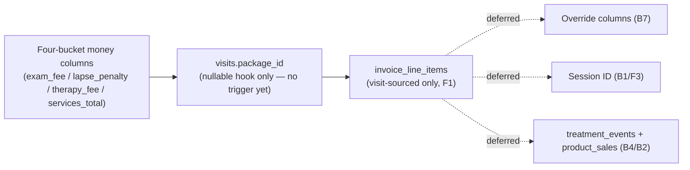

# MVP Step-Back & Reconsideration Review
### Clinic management backend — fee engine, packages pluggability, specialty services, invoicing

---

## Headline Finding

The single most important thing this review surfaces is not any one schema detail — it's a gap between two different speeds of work happening in this project. The business rules that actually came from the clinic owner (visit types, the three fee states, the rehab tier, the gap-return penalty, package hold/cancel) are a bounded, confirmed, comprehensible set. Sitting on top of that, a separate design track — the one recorded in `specialty-decision-log.md` — has spent nine numbered sub-conversations (SPECIALTY-03 through SPECIALTY-10) generating a session/encounter table, a `treatment_events` table, a polymorphic body-part linker, a shallow-patient archetype, a four-source `invoice_line_items` model, a full retail point-of-sale system (`product_sales`/`product_sale_items`), a split-payment-method schema, and a Pay-Later lifecycle. Of the 22 numbered entries in that log, the overwhelming majority are marked **OPEN** and explicitly **"not confirmed by Om."** None of it is bad engineering — it's careful, and several pieces are genuinely good ideas — but it has been generated at a pace well ahead of business confirmation, and some of it (retail sales in particular) doesn't trace back to anything the clinic owner actually asked for anywhere in `business-rules-log.md`. Your own new instruction — defer the full Packages module, keep only pluggable hooks — is exactly the right instinct, and this review's main job is to show you where else in the current design that same instinct applies, and where it doesn't.

---

## 0. Method & Source Hierarchy

You asked me to treat the material in this chat (the review prompt itself, and the four uploaded handover files) as the primary source, and to use `supabase_migration.md` only as the **baseline** — the schema as it actually exists in the database today, before any of the fee/override/packages/specialty proposals were designed. I've held that distinction throughout: whenever I say "the live schema does X," I mean what's actually in `supabase_migration.md`'s SQL; whenever I say "the proposal is Y," I mean something described in the handover files or the decision log that has not been built yet.

Two things worth flagging about the sourcing itself, in the same spirit as your own standing rule about verifying against real files rather than memory:

**`specialty-decision-log.md` was uploaded but its text wasn't present in this chat** — only its file path was. I used the `view` tool to read it directly from disk (all 219 lines, 22 entries) rather than working from the summary in `handover_specialty_context_for_packages.md` alone, because that summary only synthesizes three of the entries (1, and pieces of what became 5–9 and 13–14) for the packages track specifically. Reading the full log surfaced a much larger set of proposals — the retail/product-sales system and the Pay-Later lifecycle in particular — that the packages-focused summary never mentioned at all. If I hadn't gone and read it, this review would have missed roughly a third of what's actually in play.

**`handover-packages.md` itself was referenced constantly (by `handover-index.md`, `handover-fee-computation.md`, and `handover-pricing-integrity-overrides.md`) but never uploaded to this chat.** I did not go looking for it. Its described contents — the attendance-tracking gap, the `package_id` derivation trigger, the partial unique index, the refund override columns — are the same content already sitting in `business-rules-log.md` §8 in this project's own memory, so I used that as the equivalent source instead of treating it as missing. I mention this so you know I didn't skip that domain, I just read it from a different file than the one named in the cross-references.

**Two versions of `business-rules-log.md` are present in this project's memory** — one ending after §8, one continuing through §9 with an expanded §2 and §8. I treated the longer version as canonical since it's a strict superset with corrections layered in (e.g., the ₹180 override case being resolved in the later version, left as an open guess in the earlier one). If you're maintaining these files locally and one of them is stale, that's worth a quick check on your end, since I can't tell from here which one your actual repo currently has.

Finally, your new instruction is the binding constraint on everything below: the Packages *module* (subscriptions, attendance tracking, calendar/visit modes, closures, cancellation refunds) is deferred, full stop, but three specific hooks — `visits.therapy_fee_in_paise` as an independent column, `visits.package_id` as a nullable FK, and `invoice_line_items` naturally supporting a ₹0 line — must survive in the MVP shape. Every recommendation below was checked against that constraint before I wrote it down, and the Appendix at the end walks through the check explicitly.

---

## A. Scouting Inventory

This section is deliberately descriptive, not yet evaluative — it's the map before the decisions. Each item names what caught my attention and why; judgment on whether it's a problem worth acting on comes in B through F.

### A1 — Tenancy, RLS, and the deployment-model-conditional checks

The live schema (`supabase_migration.md`) runs every table on `v1_allow_all` — any authenticated user can read or write any row. The "real" staff/admin policies are drafted as SQL comments at the bottom of the file, not live. Layered on top of that open RLS, there's a substantial amount of trigger-level tenancy hardening — the `SECURITY DEFINER` cross-chain check in `process_new_complaint_course()`, `validate_owner_is_admin()` on both `patients` and `clinics` — that exists specifically to guard against multiple *unrelated* clinic chains sharing one Supabase project. Your own memory (and `module-1-handover.md`) already records the deployment decision: one isolated Supabase project per clinic chain. Under that decision, the scenario this hardening guards against literally cannot occur.

### A2 — The session/encounter gap, now with a fifth and sixth manifestation

`handover-index.md`'s "standing cross-cutting note" already lists four places the missing session concept causes friction: invoicing, billing correctness (same-day dedup), a constraint conflict (one-visit-per-complaint-per-day would break confirmed split-encounter behavior), and specialty multi-complaint representation. Reading `specialty-decision-log.md` in full adds two more: frontend UX for specialty logging keeps getting redesigned (Entries 6 → 12 → 22, three different approaches) partly because nobody's settled what a "session" even bounds yet, and the session *boundary itself* has been redefined mid-log — Entry 7 leaned day-level (`patient_id + clinic_id + date`), then Entry 15 superseded that with "submission-batch" (a server-issued `session_id`, echoed by the frontend across inserts in one checkout). Neither is confirmed by you.

### A3 — Fee computation: four-bucket columns, tier rates, fee-scope configurability

The four-bucket redesign (`exam_fee_in_paise`, `lapse_penalty_in_paise`, `therapy_fee_in_paise`, `services_total_in_paise` replacing the current single `consultation_fee_in_paise`) is well-motivated by a confirmed real scenario (split encounters, same complaint, same day). Two things riding alongside it are less obviously load-bearing: `clinics.consultation_fee_scope` (or the more elaborate `clinic_fee_scopes` table) exists to support a *different* business wanting `PER_COMPLAINT` scope instead of `PER_VISIT_DAY` — the handover doc's own phrasing is "a different business might," which is a tell that this isn't describing the current client. And `clinic_tier_rates` bakes in a `clinic_id` dimension for tier rates whose necessity — do this chain's three actual locations charge different rehab/regular rates from each other today? — I don't see confirmed anywhere.

### A4 — Pricing integrity & overrides

The core principle (backend derives fee amounts, never trusts a client-submitted number) is sound and has a live precedent (`derive_owner_id_from_patient()`). What's proposed on top of it — `final_amount_in_paise`/`override_reason`/`override_by`/`override_status` with a three-state (`none`/`pending`/`approved`) CHECK and an authorization trigger — has exactly one confirmed real trigger case behind it (Om's ₹180 patient), and that case is fully served by the *separate*, already-designed `patient_rate_overrides` table, not by the transactional per-visit override columns. I don't see a specific confirmed scenario that needs the transactional override's `pending` state at all.

### A5 — Packages: now explicitly scoped down by your own new instruction

Everything in `business-rules-log.md` §1 and §8 about Hold, Cancel+Refund, attendance-day tracking, `day_log` reconciliation, and the partial-unique-index on active packages is now out of scope for MVP by your own words. What remains in scope is narrower than what the handover files describe: just the column-level hooks, not the trigger that matches a visit to a package and zeroes `therapy_fee_in_paise`.

### A6 — Specialty services and `treatment_events`

This is the most actively unsettled area in the whole project. `handover-fee-computation.md` recommends extending `visit_services` with a `visit_service_complaint_links` junction (its stated "Option 2, Recommended"). `specialty-decision-log.md` Entry 2 and Entry 7, written later, have moved toward a **standalone** `treatment_events` table with its own `service_id`, `clinic_id`, `date`, and `clinician_id` columns — a materially different shape than "extend `visit_services`." Neither the handover file nor the decision log has been updated to reflect the other's latest position. On top of the table-shape question, Entry 11 adds a polymorphic link (`complaint_course_id` OR `catalog_region`) for a "shallow patient" archetype that appears nowhere in `business-rules-log.md` and, per Entry 10's own admission, "was not previously discussed anywhere" before the SPECIALTY chat invented it.

### A7 — Invoicing: line items, ghost-invoice prevention, retail, payment lifecycle

`invoice_line_items` (Entry 5, "effectively a fleshed-out Option B") is the most consequential single proposal in the log, and it's also the one your new instruction directly requires a version of. But the version described in the log is considerably larger than what your constraint asks for: it's designed to key off `num_nonnulls()` across **four** possible sources — `visit_id`, `treatment_event_id`, `package_id`/`package_purchase_id`, and a brand-new `product_sale_id` (Entry 16) — the last of which requires `invoices.patient_id` to become nullable to support anonymous retail checkouts. A deferred `CONSTRAINT TRIGGER` (Entry 13) is proposed to stop an invoice from ever having zero line items or a mismatched total. A full payment lifecycle (`Pending`/`Paid`/`Overdue`, split cash/online/card columns, `paid_by`/`paid_at` audit columns) is proposed in Entries 17–18, which also correctly notices that `daily_ledger`'s hardcoded `'Complete'` status becomes false the moment any of this ships.

### A8 — Process observations

Three things worth naming plainly, since they're patterns rather than single bugs. First, **design churn without checkpoints**: the specialty frontend UX has been redesigned three times and the session boundary twice, all inside one unbroken AI-only design thread, with no confirmation step in between. Second, **documentation drift**: the distilled handover files and the raw decision log already disagree on the specialty table shape (A6), and nothing currently flags that disagreement to a reader who only opens one of the two files. Third, **scope origin**: retail product sales and the shallow-patient archetype are the two clearest cases in this whole review of a feature that exists only because a design conversation generated it, with no anchor in anything the actual paying client said.

---

## B. Strong MVP Simplification Opportunities

Each item below follows Current → Simpler → Foundation-preserving → Future impact, then a deliberate argument against my own recommendation, per your instructions. Numbering continues the A-series so you can cite these precisely later.

### B1 — Drop the persisted session concept entirely; use a frontend-assembled batch plus one atomic write function

**Current approach.** The decision log is mid-negotiation between a day-level `sessions` row (Entry 7) and a server-issued, frontend-echoed `session_id` (Entry 15, "submission-batch"). Either way, this means a new table, new API surface on every `visits`/`treatment_events` insert, and — per Entry 15 — a rule that the frontend must never invent a `session_id` itself, only echo one the server just issued.

**Simpler approach.** Don't persist a session at all. Let the receptionist's UI collect the set of visits (and, later, treatment events) for the current sitting exactly as it already does today per `codebase-context.md`'s description of the "Current Session Bill" screen, and send them to the backend together as one payload when "Create Invoice" is clicked. A single Postgres function, not a trigger, performs all the inserts (complaint course if new → visits → visit_services → invoice → line items) inside one transaction. If any step fails — including a trigger's own `raise exception` — the whole thing rolls back together.

**Foundation-preserving check.** This is not a dead end. Entry 2's own key finding is that a session table, if it's ever built, would **not** replace the existing `patient_id + date` fee-dedup scoping that the four-bucket exam-fee/lapse-penalty logic already uses — that check is deliberately coarser than any one session and stays exactly as designed regardless. In other words, the thing session_id would actually buy you — clean grouping for specialty multi-complaint linking and for invoice assembly — is exactly the two things already being deferred in B4 and folded into the atomic function respectively. Nothing about building the atomic function today forecloses adding a real `session_id` column later; it's a pure addition, not a restructuring.

**Future impact.** If you later build `treatment_events` with true multi-complaint linking, you'll likely want a real session anchor at that point — but you'll want it *because* treatment_events exists, and building it now, before treatment_events exists, buys you nothing except a table with no consumer.

**Argument against this recommendation.** Without a persisted session boundary, there is genuinely no way to answer "was this whole submission one atomic unit" from the data itself after the fact — you'd only know because the invoice was created in one transaction, not because a row says so. If billing disputes or audits ever need to reconstruct "what happened in one sitting" independent of which invoice it landed on, the atomic-transaction approach leaves a weaker trail than a persisted `session_id` would. I think this is a real but small risk at current patient volume — the transaction boundary plus `created_at` timestamps on the resulting rows gets you 90% of the reconstruction ability — but it's not zero, and it's the honest cost of this deferral.

### B2 — Do not build retail product sales for MVP

**Current approach.** Entry 16 proposes `product_sales` (parent) and `product_sale_items` (child, itemized with quantity) as a new pair of tables, reusing `services`/`clinic_service_prices` for catalog and pricing, plus making `invoices.patient_id` nullable to support a genuinely anonymous walk-in retail transaction (someone buying a knee brace or tape without any clinical relationship).

**Simpler approach.** Don't build it. There is no entry anywhere in `business-rules-log.md` — the actual record of conversations with the clinic owner — that mentions selling physical products at the counter. This appears to be a case the design track generated on its own while working through `chk_line_item_source`'s completeness, not a requirement that came from the business.

**Foundation-preserving check.** Nothing about the minimal `invoice_line_items` shape recommended in B-below (Line, F1) forecloses adding a `product_sale_id` column and a fourth arm to the source-exclusivity check later — that's an additive migration against a table that, per Entry 8's own logic, doesn't even need to know about sessions. The `invoices.patient_id NOT NULL` question only needs answering the day retail actually gets built.

**Future impact.** If retail turns out to be real (many physiotherapy clinics do sell braces, tape, and topical products), you'll add two small tables and widen one CHECK — a low-risk, additive change per your own Module 9 safe-change taxonomy. Nothing here is expensive to defer.

**Argument against this recommendation.** If it turns out the clinic *does* want to sell products soon and this was actually discussed with the owner in a conversation that didn't make it into `business-rules-log.md` yet, then I'm wrong to call this unconfirmed — it would just be undocumented. That's a real possibility given how these logs get built (voice recordings, summarized after the fact), and it's cheap to check: ask the clinic owner directly, once, before writing this off. I'd treat "confirm whether retail is real" (see C4) as the actual action here, not a unilateral "never build this."

### B3 — Do not build the payment lifecycle (Pay Later, split payment columns, Overdue) for MVP

**Current approach.** Entries 17–18 propose moving off "a visit row existing = complete and paid" toward a real lifecycle: invoices created at checkout regardless of payment, `Pending` when a receptionist chooses Pay Later, three dedicated payment-amount columns (`cash_amount_in_paise`/`online_amount_in_paise`/`card_amount_in_paise`), and `Overdue` derived at read time against a threshold Om mentioned informally ("settles weekly") but never confirmed as policy.

**Simpler approach.** Leave it exactly as it is today. This is the cleanest deferral in the whole review because the live schema's own inline comment already says so: `payment_status` defaults to `'Paid'` with a comment reading *"'Pending'/'Overdue' kept for future credit/package billing."* The original schema author — you — already decided this was future scope before any of the specialty conversation happened. Nothing needs to change in the schema to defer this; the CHECK constraint already permits the values, unused.

**Foundation-preserving check.** Complete. This is a zero-cost deferral — there is no column to add, no migration to plan, nothing to retrofit. The day you actually build Pay Later, the values are already sitting there waiting.

**Future impact.** The one thing worth flagging now, cheaply, so it doesn't surprise you later: `daily_ledger`'s view definition hardcodes `'Complete' as status` — Entry 17 correctly notes this becomes factually wrong the instant an unpaid invoice can exist. That's a one-line fix to make *when* Pay Later ships, not something to solve today.

**Argument against this recommendation.** If "settles weekly" is actually how this clinic already operates informally (cash changing hands off the books until a weekly reconciliation), then the app is already silently misrepresenting reality by forcing every visit to read as paid-in-full immediately — that's a real gap between what the software claims and what's actually happening financially, and it's not really a *feature* you're choosing to defer so much as a fact about the business the software doesn't yet model. I'd want to know, from Om or the owner directly, whether "settles weekly" describes real current behavior before being fully confident this is a safe defer versus a data-integrity gap that just hasn't caused visible pain yet.

### B4 — Do not build `treatment_events` or multi-complaint specialty linking for MVP; keep logging specialty services as ordinary `visit_services` rows

**Current approach.** The design has moved from "extend `visit_services`" (handover doc) to a standalone `treatment_events` table with its own linking junction (`treatment_event_links`, XOR complaint-course-or-region, with an `is_primary` flag) plus a full jointly-linked-revenue reporting convention (Entry 21).

**Simpler approach.** Keep logging every specialty service (cupping, dry needling, laser) as a normal `visit_services` row against whichever single complaint course is most clinically relevant that visit, exactly as the schema already supports today. Entry 1's own correction is the reason this is safe: package exclusion of specialty treatments is automatic, purely because specialty charges land in `services_total_in_paise`, a column the package-matching trigger never touches — there was never a `category != 'PREMIUM'` filter doing real work, and there's no multi-complaint table needed to preserve that separation either.

**Foundation-preserving check.** The billing money is captured correctly under the simple version — a ₹500 cupping charge shows up in `services_total_in_paise` and rolls into `grand_total_in_paise` regardless of which single complaint it's attributed to. What's lost is *structured* multi-complaint attribution for reporting ("this ₹500 was really for the neck and the back jointly"), which is a real but secondary loss unless pricing itself depends on complaint count.

**Future impact.** That's the one load-bearing condition, and it's exactly item C3 below: if any actual named specialty service is confirmed to be priced `PER_COMPLAINT` (charge scales with how many body parts get treated in one application) rather than `FLAT_ONCE`, then the simple version under-bills or requires a manual workaround (logging the same service multiple times, once per complaint, at full or split price) every single time it happens — which could get old fast if it's a common service. If everything specialty is `FLAT_ONCE` today, the simple version has no billing downside at all, only a reporting one.

**Argument against this recommendation.** Reporting isn't nothing — the whole point of the flag/red-zone and treatment-history features is that "what actually happened to this patient" needs to be reconstructable later, and if a cupping session that touched three complaints is only ever attributed to one of them in the data, that's a real, permanent loss of clinical history accuracy, not just a cosmetic invoicing gap. I'd weigh this against how often multi-complaint specialty applications actually happen in this specific clinic's daily practice — if it's routine, the simplification costs more than it looks like on paper.

### B5 — Simplify fee-scope configurability to a hardcoded behavior, not a configurable column or table

**Current approach.** `clinics.consultation_fee_scope` (or the more decoupled `clinic_fee_scopes(clinic_id, fee_type, scope)` table) generalizes "does the exam fee and lapse penalty share across same-day complaints, or apply per complaint" into a per-clinic, per-fee-type setting.

**Simpler approach.** Don't add the column or the table. Hardcode `PER_VISIT_DAY` behavior directly into the same-day-dedup trigger logic (B1's atomic function, or wherever the exam-fee/lapse-penalty assignment lives). The handover doc's own justification for the configurable version is "a different business might" want `PER_COMPLAINT" — that's a sentence about a hypothetical future customer, not about this client's three locations.

**Foundation-preserving check.** Complete — adding a `consultation_fee_scope` column with a default later, once a second scope is actually needed, is a trivially safe migration (a new nullable-with-default column; every existing row's real behavior is already what the default would represent).

**Future impact.** If you ever do sell this to a second clinic chain with different fee-sharing preferences, you add one column and one branch in the trigger. That's a much smaller lift than most of the other deferred items in this review.

**Argument against this recommendation.** This is the cheapest one to keep even if unneeded — a single nullable text column with a CHECK and a default costs essentially nothing to add now versus later, so the "why not just build it" case is genuinely strong here, stronger than for retail or treatment_events. I'd call this a toss-up rather than a confident recommendation either way; the only reason I'm listing it as a simplification candidate at all is that it's one more piece of configurability surface for a system whose stated MVP philosophy is explicitly "no configuration — every rate is a fixed, seed-level value" (`business-rules-log.md` §6). Building a switch that's designed to be flipped, in a system that's promised not to be flippable yet, is a small internal inconsistency worth noticing even if the cost of building it is low.

### B6 — Confirm whether `clinic_tier_rates` actually needs a `clinic_id` dimension before building it that way

This isn't a firm recommendation so much as a flag that the current design carries an unconfirmed assumption. `clinic_tier_rates(clinic_id, tier, daily_rate_in_paise, package_rate_in_paise, exam_fee_in_paise)` bakes in per-clinic variance on top of per-tier variance — two dimensions where only one (tier: 200 regular vs. 300 rehab) is actually confirmed by Om. The `clinic_id` dimension is carried over by analogy to `clinic_service_prices`, which is a real, working pattern for a *different*, already-confirmed need (the three locations charging different machine prices). Whether the three locations *also* want independently different tier rates is not stated anywhere I can find. If they don't, a plain `tier_rates(tier, daily_rate_in_paise, package_rate_in_paise, exam_fee_in_paise)` table with no clinic scoping at all is simpler, and clinic-scoping it later (adding a `clinic_id` column, defaulting new rows to the shared rate) is a safe, additive change. I've put the actual confirmation question in C2 rather than resolving it here, because it's genuinely not mine to decide.

### B7 — Build the transactional visit-level override as two plain columns, not a three-state approval workflow

**Current approach.** `final_amount_in_paise`/`override_reason`/`override_by`/`override_status` with a CHECK enforcing that `none`/`pending`/`approved` states keep the right columns null or filled, plus a trigger deriving `override_by` from `auth.uid()` and gatekeeping the move to `approved` behind `role = 'admin'`.

**Simpler approach.** Build `final_amount_in_paise` and `override_reason` as two nullable columns, full stop — no `override_status`, no pending state, no separate approval step. Since `business-rules-log.md` §6 already states the MVP-wide policy that "every rate and rule stays a fixed, seed-level value, editable only through direct database access," the admin — who per the source material appears to be on-site and directly reachable, not a remote approver reviewing a queue — can set `final_amount_in_paise` directly, the same way they'd edit any other value during this phase. `override_by` can still be captured (worth keeping for the audit trail), just written at the same time as the override itself rather than moving through a state machine to get there.

**Foundation-preserving check.** The one confirmed transactional need in the whole review — Om's ₹180 case — is actually served by the **separate** `patient_rate_overrides` table (a standing per-patient rate), not by this visit-level mechanism at all. I don't see a specific confirmed scenario anywhere that needs a *one-off* visit-level override, let alone one that needs to move through a pending/approved lifecycle. Adding `override_status` and its CHECK later, once a receptionist-initiated request flow is actually wanted, is additive — existing rows would just get `override_status = 'approved'` by convention (or the column could even default to `'approved'` for anything with a non-null `override_by`, satisfying the CHECK trivially for historical data).

**Future impact.** The full state machine becomes worth building the day a receptionist, not an admin, needs to be able to *flag* a price exception without being trusted to actually change it — i.e., the day front-desk staff start handling this instead of the owner directly.

**Argument against this recommendation.** The authorization trigger (deriving `override_by` from `auth.uid()` rather than trusting a client-submitted value) is genuinely good, cheap security hygiene regardless of whether the pending state exists — and if you build the two-column version now and skip that derivation step because it "doesn't matter yet since only the admin touches this," you're recreating exactly the kind of trust-the-client gap the rest of this schema has been careful to avoid everywhere else. I'd keep the `auth.uid()`-derivation discipline even in the simplified version; it costs nothing extra and it's consistent with the pattern this whole schema is built on.

### B8 — Leave `FLAT_TOTAL` out of the `patient_rate_overrides.override_type` CHECK for now

The confirmed ₹180 case resolves to `CONSULTATION_FEE = 0` plus `THERAPY_RATE = 180` — the component model, not `FLAT_TOTAL`. The handover doc itself says `FLAT_TOTAL` "stays available in the design for a patient who genuinely wants a true single-number-no-matter-what arrangement," which is speculative language for a case that hasn't happened. Widening a CHECK-constrained fake-enum to add a value later is explicitly one of the safe, low-risk changes in your own Module 9 taxonomy — there's no cost to leaving it out now.

### B9 — Defer the shallow-patient/service-seeker archetype and the polymorphic body-part link entirely, alongside B4

Entry 10 states plainly this archetype "was not previously discussed anywhere in `business-rules-log.md` or any handover file" before the SPECIALTY chat introduced it. It's downstream of the `treatment_events` decision (B4) in every way — the polymorphic link (Entry 11) exists specifically to let a treatment event attach to a body region instead of a complaint course for exactly this archetype. If B4 is deferred, this has nothing to attach to and should be deferred with it. The one piece worth remembering for later, cheaply, is Entry 20's finding: whenever this *does* get built, a `patients`-insert-time provisioning trigger (mirroring `process_new_complaint_course()`) will need to close a read-visibility gap that today's RLS being wide open completely hides — but that's a "when RLS is real" problem, covered in D1/E-series below, not an MVP blocker now.

---

## C. Undersolved / Semi-Resolved Issues

These are not mine to resolve — they're genuine forks that need a direct answer from you (or from you relaying the clinic owner's answer), not an inference from the documents.

**C1 — Joining fee vs. per-complaint exam fee.** Already flagged explicitly in `handover-fee-computation.md` and `handover-index.md`, and it's real: today's confirmed rule is that a returning patient with a brand-new, unrelated complaint months later pays a *fresh* ₹350 exam fee. You separately floated a once-ever "joining fee" that would NOT re-charge that patient. These produce different numbers on real invoices the first time a long-standing patient shows up with something new. This blocks the exam-fee trigger from being written at all until it's answered.

**C2 — Do the three existing locations actually charge different rates from each other today?** This determines whether `clinic_tier_rates` needs its `clinic_id` dimension now (B6) or can start as a single shared rate table. I don't see this confirmed either way in the source material — the per-clinic *columns* (`consultation_fee_first_in_paise`/`subsequent_in_paise`) existing since Iteration 2 shows the schema anticipated variance, not that variance is actually in use today.

**C3 — Which specific specialty services are `FLAT_ONCE` vs. `PER_COMPLAINT`?** This is the load-bearing condition for B4. If dry needling, cupping, and laser are all confirmed `FLAT_ONCE` in actual practice, deferring `treatment_events` has zero billing-correctness cost. If any of them scale by complaint count, that needs resolving before the simple `visit_services`-only approach is safe to commit to for MVP.

**C4 — Is retail product sale a real near-term need, or was it generated by the design process itself?** Directly determines B2. Worth a single direct question to the clinic owner rather than either building it preemptively or dismissing it on the strength of an absence in the notes, since these logs are built from summarized voice recordings and could simply be missing a conversation that happened.

**C5 — Invoice boundary: one invoice per day, or one per sitting?** Entry 8 explicitly leaves this as "Om's call once the clinic has an actual workflow to observe" — no schema rule blocks either answer today (`invoices` has no per-patient-per-day cardinality constraint), so this doesn't need to be resolved before MVP ships, but it will need an answer once the pilot generates enough real invoices to see the pattern.

**C6 — Should patient flagging (red-zone) be admin-only, or can any staff member flag a patient?** Still explicitly open in `business-rules-log.md` §1 — "the original conversation never said." Low schema cost either way (it's an RLS/permission question, not a structural one), but worth deciding before the feature ships since it affects who the RLS policy grants INSERT to.

**C7 — Reconcile the specialty table-shape disagreement between `handover-fee-computation.md` and `specialty-decision-log.md`.** One says "extend `visit_services` via a junction" (its stated recommendation); the other has since moved to a standalone `treatment_events` table with different columns. Neither document has been updated to reflect the other. This doesn't block anything today since B4 defers the whole area, but whoever picks this back up later should not open `handover-fee-computation.md` alone and assume its recommendation is still current — it isn't, as far as the decision log's own later entries are concerned.

---

## D. Complexity That Should Stay

Things that look like they could be simplified but where I think the complexity is earning its place.

**D1 — The cross-chain tenancy `SECURITY DEFINER` hardening (Iterations 7–9).** Under the one-Supabase-project-per-chain deployment model, this genuinely cannot be triggered — but it's already built, already covered by the verification checklist's "cross-chain rejection" test, and costs nothing ongoing to keep. Ripping out correct, tested, harmless code to chase architectural purity is negative-value work: it only introduces risk (a regression while removing it) for zero present benefit. If the deployment model ever changes — and for a solo developer bootstrapping this, consolidating multiple future clients into shared infrastructure to save Supabase costs is at least plausible — this is already done. Keep it, and don't build any *more* of it than already exists.

**D2 — `derive_owner_id_from_patient()` and the "derive, don't trust" pattern as it's already applied.** This is real, live, load-bearing, and cheap. It should absolutely stay as the model for anything new that touches ownership or tenancy. (Note: I'm deliberately *not* including the not-yet-built fee-derivation trigger here — see B7/F2 for why that specific application of the same principle is a fair deferral candidate even though the principle itself is sound.)

**D3 — `grand_total_in_paise` as a generated column.** Zero ongoing cost, structurally prevents drift, and is exactly the kind of protection that's worth having by default rather than earning through observed bugs first.

**D4 — The `security_invoker = true` convention for future views.** `handover-pricing-integrity-overrides.md` catches a real, documented Postgres gotcha (views bypass RLS by default, running as their creator rather than the querying user) before it ever bites. This costs nothing to apply and should stay a standing habit for any view built from now on, including the deliberately minimal `invoice_line_items`-adjacent views recommended in F1.

**D5 — The `patient_clinic_access` cross-branch identity model.** One shared patient identity per chain, with per-branch attendance tracked separately, is a confirmed, real, already-working requirement (a chain of three clinics under one owner) — not speculative generality. This is core, not decoration.

**D6 — Single-admin-per-chain (`owner_id` as a plain FK to one profile).** Already correctly resolved as deferred rather than built out into a `businesses` table — the existing single-owner model matches the actual current business structure, and a real multi-admin-per-chain need would justify revisiting it, which hasn't happened.

---

## E. Safe Deferrals

Confirming and reinforcing what's already correctly deferred, plus items this review adds.

- **The full Packages module** (E1) — subscriptions, attendance-day tracking, `day_log`/`attended_days`/`missed_days` reconciliation, Hold's date-segment representation, Cancel+Refund — deferred by your explicit new instruction. Nothing to add here beyond confirming the pluggable hooks survive (see Appendix).
- **`handle_new_user()` trigger** (E2) — manual `profiles` provisioning is genuinely fine for a handful of staff accounts during a pilot; already correctly identified as non-urgent in `module-1-handover.md`.
- **`clinician_id` role-validation trigger** (E3) — a real gap (nothing stops a non-clinician profile being set as `clinician_id`), but it's downstream of RLS actually being turned on; sequencing, not indefinite deferral.
- **Index optimization on `clinician_id` and similar** (E4) — correctly deferred already; matters at real scale, not at pilot volume.
- **Denormalized display-name sync (`complaint_name`, `service_name`, `linked_complaint_name` drifting from their FKs)** (E5) — downgraded here from "gap" to genuinely low-stakes: these are display snapshots, not the authoritative relationship (the FK is), so drift is a cosmetic UI bug, not a financial or clinical integrity risk. A sync trigger would be solving a low-severity problem with backend automation; frontend discipline is enough for now.
- **`FLAT_TOTAL` override type** (E8, see B8) — zero cost to add whenever it's actually needed.
- **The full SPECIALTY-track additions** (E9): retail (`product_sales`/`product_sale_items`), the payment lifecycle (Pay Later, split payment columns, `Overdue`), `treatment_events` and its polymorphic linking, the shallow-patient archetype, and the persisted session concept — all covered in detail in B1–B4 and B9 above.

---

## F. Options & Recommendations

The deepest comparative treatment, reserved for the handful of decisions with the most riding on them.

### F1 — What shape should `invoice_line_items` actually take for MVP?

Your instruction is explicit that this table must exist and must naturally support a ₹0 package-covered line. The decision log's version is considerably larger than that requirement: four possible sources (`visit_id`/`treatment_event_id`/`package_id`/`product_sale_id`) reconciled via `num_nonnulls() = 1`, plus a deferred `CONSTRAINT TRIGGER` checking line-item completeness at commit time.

I'd recommend building only what the constraint actually asks for:

```sql
create table invoice_line_items (
  id uuid primary key default gen_random_uuid(),
  invoice_id uuid not null references invoices(id) on delete cascade,
  visit_id   uuid references visits(id),   -- the only source MVP needs
  description text not null,                -- denormalized display text (e.g. complaint name)
  amount_in_paise integer not null,         -- legitimately 0 for a package-covered visit
  created_at timestamptz not null default now()
);
```

(Sketch only — not a vetted migration; clinic_id/tenancy scoping and any guard trigger would need the same design pass every other table here already got.)

This is a single-source table today. Adding `treatment_event_id`, `package_id` as a real *source* (distinct from a visit that happens to reference a package via `visits.package_id`), and `product_sale_id` later is a matter of adding nullable columns and widening a `CHECK` from "exactly one of one" to "exactly one of N" via `num_nonnulls()` — additive, low-risk, exactly the kind of change your own Module 9 taxonomy calls safe. Notably, this also means you don't need `visits_with_effective_charge` (the override-aware view) yet either — since B7 defers the visit-level override mechanism, this table can read `grand_total_in_paise` directly. Deferring one thing correctly let a second, downstream thing simplify too.

The ghost-invoice deferred constraint trigger (Entry 13) is worth building alongside even this minimal version, not deferring — it's cheap, purely backend, and protects real financial data from a genuinely easy-to-hit bug class (an invoice created with no line items, or a total that silently disagrees with its parts). I'd treat this one differently from the rest of the SPECIALTY-track additions: it's a safeguard for something you're building anyway, not new scope.

### F2 — Should the backend independently derive fee amounts, or trust the frontend for now?

`handover-pricing-integrity-overrides.md` frames this as a closed question ("this domain is fully specified... the only pending item is building the trigger, not deciding anything"). I'd reopen it, specifically for timing.

The "derive, don't trust" principle is correct and should absolutely be the target end state. But building the fee-derivation trigger requires the rate-table infrastructure (`clinic_tier_rates` or its simpler cousin from B6) to exist first, and it protects against a client submitting a *wrong* fee — while RLS remains entirely `v1_allow_all`, meaning any authenticated user can already write directly to `invoices.amount_in_paise`, bypassing `visits` and this entire derivation layer altogether. Put plainly: building fee-derivation now closes a narrower gap than the one still wide open right next to it. For a pilot with a small number of known, trusted front-desk staff — not a public-facing multi-tenant product with unknown actors — I'd sequence real RLS policies (the ones already drafted as comments in `supabase_migration.md`) ahead of fee-derivation, and let the frontend's already-correct calculation logic carry the load until either RLS is real or a second, less-trusted client comes aboard.

### F3 — Session concept: build it, or keep deferring it as in B1?

Already argued in B1; restating the comparison because it's one of the two or three highest-leverage decisions in this whole review. The persisted version buys clean grouping for specialty linking and invoicing; the deferred version gets both of those from the atomic-transaction function and B4's deferral instead, at the cost of a weaker after-the-fact audit trail for "was this one sitting." I recommend deferring, revisited the day `treatment_events` actually gets built (since that's the one consumer that would make a real session concept earn its keep).

### F4 — Tier-rate clinic-scoping: build scoped now, or confirm first?

Covered in B6/C2 — genuinely not my call, but the two paths' costs are asymmetric enough to be worth stating plainly. Building it scoped now and discovering the three locations never actually diverge costs you nothing except an unused column dimension. Building it unscoped now and discovering they *do* need independent rates costs a migration that has to reassign every existing rate row to a specific clinic — more expensive, though still additive rather than destructive. Given that asymmetry, if you can't get a quick confirmation from the clinic owner before this needs building, I'd lean toward keeping the `clinic_id` column (cheap insurance) even though B6 flags it as possibly unnecessary.

### F5 — Recommended build sequence if/when the deferred items above do get picked back up

Entry 9's own sequencing logic is sound and matches this review's conclusions once you drop the deferred pieces from the middle of it:



The solid path is what I'd build for MVP; the dotted branches are everything this review recommends holding off on, sitting downstream and unblocked-but-not-required.

---

## G. Prioritized Decision Queue

**1. Must decide before implementation**
- C1 — joining fee vs. per-complaint exam fee (blocks the exam-fee trigger outright)
- C4 — is retail product sale real, or was it self-generated scope? (determines whether B2 is a confident "never" or just a "not yet")
- C3 — confirm specialty services are `FLAT_ONCE`, not `PER_COMPLAINT`, before committing to B4's simple `visit_services`-only approach

**2. Worth discussing/reconsidering**
- F2 — fee-derivation trigger timing relative to real RLS rollout
- C2 / B6 / F4 — tier-rate clinic-scoping
- B7 — whether the transactional override needs the pending/approved workflow at all, or just the two plain columns
- C7 — reconcile the handover doc vs. decision log disagreement on specialty table shape (even if the underlying build is deferred, the documentation shouldn't actively contradict itself)
- C6 — flag/red-zone permission scope (admin-only vs. any staff)

**3. Safe to defer**
- B1/F3 — persisted session_id / day_group
- B2 — retail product_sales/product_sale_items
- B3 — Pay-Later payment lifecycle, split payment columns
- B4/B9 — treatment_events, polymorphic body-part linking, shallow-patient archetype
- B8 — `FLAT_TOTAL` override type
- E1 — full Packages module (already decided by your instruction)
- E3/E4 — clinician_id role trigger, clinician_id indexes
- E5 — denormalized display-name sync triggers

**4. Keep as-is**
- D1 — cross-chain tenancy `SECURITY DEFINER` hardening
- D2 — `derive_owner_id_from_patient()` and the derive-don't-trust pattern as already applied
- D3 — `grand_total_in_paise` as GENERATED
- D4 — `security_invoker = true` convention
- D5 — `patient_clinic_access` cross-branch identity model
- D6 — single-admin-per-chain `owner_id` model

**5. Ignore for now**
- E5's underlying premise as a "gap" — it's cosmetic, not a real integrity risk, and doesn't need a place in an active gaps log
- `patients.blood_type`'s missing CHECK constraint — worth one question (is this field even used for a physiotherapy clinic, the same way `insurer_name` turned out to be unused) before spending effort validating a field that might not need to exist at all
- B5's `clinic_fee_scopes` table specifically (as opposed to a single hardcoded behavior) — cheap enough either way that it isn't worth spending more decision-cycles on than this review already has

---

## Appendix: Pluggable-Packages Compliance Check

Your instruction was explicit and binding, so here's the direct trace showing the recommended MVP shape above still honors it.

**`visits.therapy_fee_in_paise` must exist as an independent column.** Satisfied — it's part of the four-bucket redesign (F5, step 1), which this review recommends building now, not deferring. A future package-matching trigger can zero this one column without touching `exam_fee_in_paise`, `lapse_penalty_in_paise`, or `services_total_in_paise`.

**`visits.package_id` must exist as a nullable hook.** Satisfied, with a scope note: build the *column* now (nullable FK to `packages`, unused), but not the trigger that matches a visit to an active package and zeroes `therapy_fee_in_paise` — that trigger only makes sense once Packages proper exists, which is explicitly deferred. The column sitting there, always null, costs nothing and is exactly what "pluggable, not built" means.

**`invoice_line_items` must naturally support ₹0 package-covered visit line items.** Satisfied by construction — `amount_in_paise` is a plain integer column with no CHECK excluding zero, so a package-covered visit's line item is just an ordinary row where that value happens to be 0. Nothing about the minimal, visit-sourced version recommended in F1 needs a special case for this; it falls out of the column simply being an integer.
